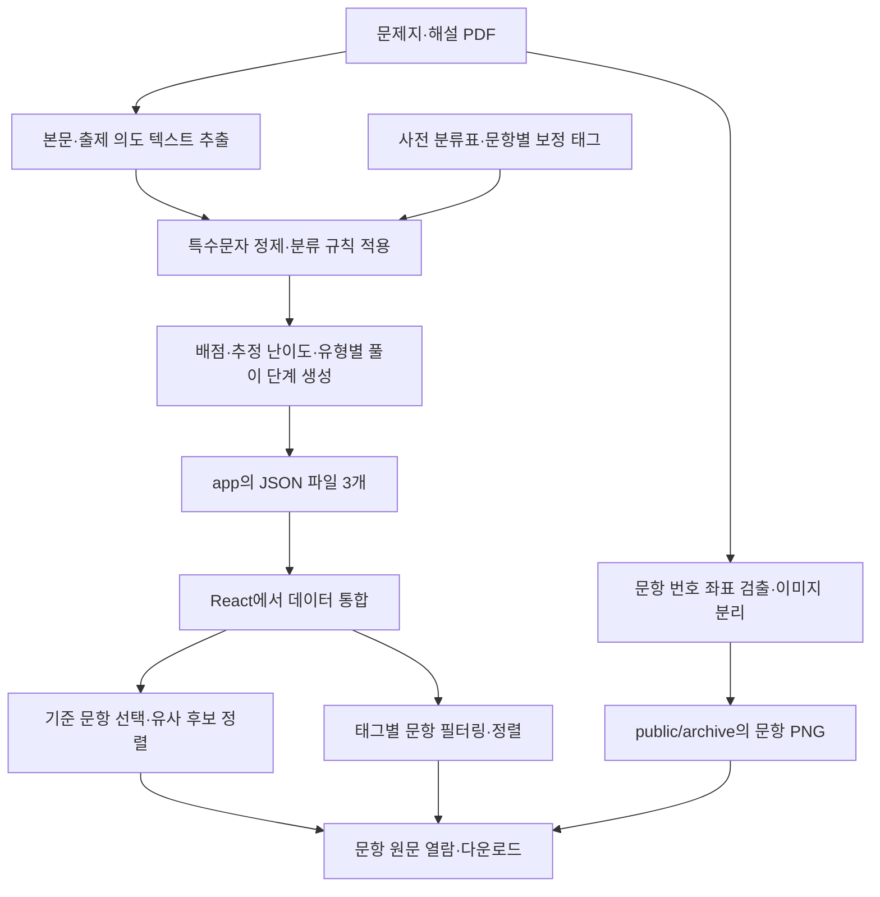

# Project N 구현 상세 분석

> 작성 기준: 2026-09-21의 로컬 코드와 데이터. 기준 커밋: `4f53f9ad91effda059dc943faf8a1c0efc7fa82b`.
>
> 목적: 실제 구현을 이해하고 자기소개서·면접·포트폴리오에서 근거에 맞게 설명하기 위한 기술 문서.
>
> 사실 구분: **구현 사실**은 소스에서 확인한 내용, **집계 결과**는 저장된 파일을 읽어 계산한 내용, **사용자 제공 경험**은 업무 맥락과 성과, **해석·개선 제안**은 코드에서 도출한 판단이다. 개발자의 개인 기여도, 운영 사용량, 업무 시간 단축은 코드만으로 입증하지 않는다.

## 목차

1. 서비스의 정확한 정의와 업무 배경
2. 전체 구조와 파일별 역할
3. 기술 스택과 실행 환경
4. 데이터 규모와 저장 구조
5. PDF 정규화
6. 문항 이미지 분리
7. PDF 텍스트 추출과 정제
8. 분류 체계와 문항별 보정
9. 문항 JSON 스키마와 생성
10. 유사 문항 추천 알고리즘
11. 실제 데이터로 확인한 추천 예시
12. 유형별 문항 탐색
13. 프론트엔드 화면과 사용자 흐름
14. 교육과정 비교 화면과 SEO
15. 자동화·사람의 판단·AI의 역할
16. 품질 관리와 현재 한계
17. 성능 특성과 확장 방향
18. 실행·재생성 절차
19. 자기소개서·면접 설명 가이드
20. 검증 범위와 근거 인덱스
21. 부록: 전체 분류 사전, 태그 빈도, 문항별 보정표

## 1. 서비스의 정확한 정의와 업무 배경

### 1.1 실제 구현의 정의

Project N은 평가원 수학 문제지·해설 PDF에서 문항 이미지와 검색용 메타데이터를 준비하고, 웹에서 원문을 열람하면서 분류·난이도·설명 텍스트의 단어 중복도를 기준으로 유사 문항을 추천하는 서비스다.

핵심 구조는 **Python 배치 전처리 + 정적 PNG/PDF·JSON 저장 + React 브라우저 내 필터링·정렬**이다.

- JSON은 저장 형식이다. 분류 알고리즘이나 DB 제품의 이름이 아니다.
- `categories`는 문항에 붙인 개념·유형 문자열 배열이다.
- 검색용 JSON과 원문 PNG는 별도로 저장한다.
- 문항 선택을 기준으로 한 추천과, 특정 태그에 해당하는 문항 목록 조회를 제공한다.
- 자유로운 자연어 질문에 답하는 챗봇은 아니다.
- LLM API, 임베딩, 벡터 DB, BM25, 모델 기반 reranker, RAG는 현재 핵심 코드에 없다.
- 개발 과정의 Codex 활용과 서비스 실행 중 AI 모델 호출은 구분해야 한다.

### 1.2 사용자 제공 경험

재수학원에서 최신 모의고사 30문항 각각에 대해 유사 기출을 찾아 제공했다. 기존에는 약 3개년의 기출을 눈으로 비교하여 한 회차에 약 6시간이 걸렸다. 과거 대학 시절에는 수식·그래프가 섞인 이미지의 OCR 처리 문제로 유사 프로젝트를 중단했다. 이번에는 Codex를 구현 보조 수단으로 사용했다.

사용자가 설명한 개선 결과는 탐색 범위 약 3개년 → 11개년, 한 회차 업무 시간 약 6시간 → 1~2시간, 학원 학생들의 실제 사이트 사용이다. 이는 서버 응답속도나 추천 정확도 측정값이 아니라 업무 성과다.

## 2. 전체 구조와 파일별 역할



PDF 처리는 개발·데이터 준비 단계에서 실행한다. 사용자가 문항을 클릭할 때 Python을 다시 실행하지 않는다. 프론트엔드에서 JSON을 직접 import하고 원문은 정적 URL로 읽는다. 웹 호스팅·렌더링 런타임은 있지만 별도 업무용 검색 API → DB → AI 호출 경로는 없다.

| 경로 | 역할 |
|---|---|
| `scripts/normalize_archive_pdfs.py` | 특정 PDF 표지 제거, 메타데이터 제목 정리, 결과 검증 |
| `scripts/crop_questions.py` | 번호 좌표 기반 문항 이미지 생성, 스캔 대응, 검수 보고서 |
| `scripts/build_problem_journeys.py` | 본문·출제 의도 추출, 분류, 난이도·풀이 단계 생성, JSON 출력 |
| `app/question-categories.ts` | 2026~2027 일부 회차의 문항별 사전 분류표 |
| `app/problem-journeys.json` | 공통·확률과 통계 문항 메타데이터 |
| `app/calculus-journeys.json` | 미적분 선택문항 메타데이터 |
| `app/legacy-journeys.json` | 과거 가형·나형 문항 메타데이터 |
| `app/page.tsx` | 시험 선택, 이미지·PDF 표시, 유사도 계산, 추천·이동 |
| `app/categories/page.tsx` | 유형별 목록에 필요한 데이터 필드 선별 |
| `app/categories/CategoryProblemBrowser.tsx` | 태그 필터링, 최신·과거·난이도 정렬 |
| `app/curriculum/page.tsx` | 교육과정별 과목·단원과 출제 유형 정의 |
| `app/curriculum/ExamTypeExplorer.tsx` | 직접·간접 출제 구분, 유형별 목록 링크 |
| `app/curriculum/CurriculumConnections.tsx` | 교육과정 단원 간 연결선 SVG |
| `app/curriculum/MobileEraNavigation.tsx` | 모바일 교육과정 선택 |
| `app/globals.css` | 화면 배치, 문항 뷰어, 반응형 스타일 |
| `app/layout.tsx`, `app/site.ts` | 공통 레이아웃, 사이트 정보, SEO 메타데이터 |
| `scripts/generate_seo_files.mjs` | 빌드 전 robots.txt·sitemap.xml 생성 |
| `components/ui/` | UI 구성요소. 존재하는 모든 컴포넌트가 실제 화면에서 쓰이는 것은 아님 |
| `public/archive/` | PDF·문항 PNG·crop 검수 보고서 |

## 3. 기술 스택과 실행 환경

아래 버전은 `package.json` 선언값이다. Python 라이브러리 버전은 별도 잠금 파일로 확인되지 않았다.

| 구분 | 구현 |
|---|---|
| 웹 언어 | TypeScript, TSX |
| 프론트엔드 | React / React DOM 19.2.6 |
| 앱 실행 | Vinext 1.0.0-beta.5, Vite 8.0.13 |
| 라우팅·파일 구성 | Next.js App Router 형식의 `app/`, `next` API import |
| 스타일 | Tailwind CSS 4.2.1, 전역 CSS |
| UI | Base UI, shadcn 관련 구성, Lucide 아이콘 |
| 전처리 언어 | Python |
| PDF 텍스트·좌표 | pypdf, pdfplumber |
| PDF 이미지 렌더링 | pypdfium2 |
| 이미지·픽셀 처리 | Pillow, NumPy |
| DB | 애플리케이션에서 사용하는 DB 연결 없음 |
| 데이터 파일 | JSON, PDF, PNG, TSV |
| AI API·모델 | 서비스 소스에서 호출 확인되지 않음 |
| 검색 기술 | 배열 필터링, 태그 포함률·Jaccard, 난이도 거리, Dice 계수 |
| 품질 도구 | oxlint, oxfmt |
| Node 요구사항 | 22.13.0 이상 |

`vite.config.ts`는 Vinext, Sites, Cloudflare Vite 플러그인을 구성한다. `vinext/server/fetch-handler`와 `nodejs_compat`를 사용하고 `.openai/hosting.json`의 D1·R2 값에 따라 바인딩을 구성하도록 되어 있다. 현재 두 값은 `null`이어서 바인딩 배열은 비어 있다. 플러그인이 있다는 사실을 DB 사용 또는 AI API 사용으로 설명하면 안 된다.

`next.config.ts`에는 `output: 'export'`가 있다. 실제 npm 실행 명령은 `vinext dev`, `vinext build`이며 `start`는 생성된 서버 설정을 이용한 `wrangler dev`다. 이 설정만으로 실제 운영 호스팅 주소나 배포 상태를 확정하지 않는다.

## 4. 데이터 규모와 저장 구조

### 4.1 현재 파일을 직접 집계한 결과

| 항목 | 수치 |
|---|---:|
| 학년도 | 2017~2027, 11개 학년도 |
| 시험 회차 | 32회차 |
| 문항 PNG | 1,682개 |
| 현재 archive 아래 PDF 파일 | 175개 |
| 추천용 JSON 레코드 | 1,546개 |
| 추천 데이터의 고유 분류 태그 | 89개 |
| 중복 문항 ID | 0개 |
| 한 문항 안의 중복 태그 | 0개 |
| JSON에 대응하는 PNG 누락 | 0개 |
| 본문이 빈 레코드 | 60개 |
| 대체 출제 의도 문구 레코드 | 152개 |
| crop 기록 | 1,682행 |
| crop 검수 후보 | 27행 |

11개 학년도에 걸쳐 있으며 2027학년도 수능은 포함하지 않는다. 모든 학년도의 3회차가 완결된 33회분이라는 의미가 아니다. README의 원본 PDF 130개라는 수집 시점 기록과 현재 파일 175개는 다른 집계이므로 혼용하지 않는다. 현재 PDF 수에는 저장소의 실제 파일을 모두 세었고 고유 원본 수를 의미하지 않는다.

| JSON | 범위 | 레코드 | 바이트 |
|---|---|---:|---:|
| `problem-journeys.json` | 2022~2027 공통·확통 | 510 | 839,038 |
| `calculus-journeys.json` | 2022~2027 미적 | 136 | 245,049 |
| `legacy-journeys.json` | 2017~2021 가형·나형 | 900 | 1,485,697 |

영역별로 공통 374개, 확통 136개, 미적 136개, 가형 450개, 나형 450개다. 최신 체제 기하 선택문항 136개는 PNG에는 있지만 추천 JSON에는 없다. 과거 가형 안에는 기하 관련 태그가 있으므로 ‘기하 내용이 전혀 없다’와는 다르다.

본문이 빈 60개는 2021학년도 수능 가형 30개·나형 30개다. 이 사실만으로 실패 원인을 특정하지 않는다. 대체 출제 의도는 공통·확통 62개, 미적 16개, 과거 가형·나형 74개다.

### 4.2 원문 파일 경로

```text
public/archive/
  2026 수능/
    2026 수능 확통.pdf
    2026 수능 확통 해설.pdf
    Questions/
      공통/
        2026 수능 공통 01번.png
      확통/
        2026 수능 확통 23번.png
      미적/
      기하/
  2021 수능/
    Questions/
      가형/
      나형/
  .crop-reports/
    questions.tsv
    flags.tsv
```

현대 체제에서는 공통 1~22번을 선택과목별로 중복 저장하지 않는다. 회차당 공통 22개와 선택 8개씩 3과목으로 46개다. 과거 체제는 가형·나형 각각 30개로 회차당 60개다.

이미지 경로는 JSON에 별도 URL 필드로 저장하지 않는다. 웹에서 학년도·시기·영역·번호를 조합하고 각 경로 요소를 `encodeURIComponent`로 인코딩한다.

## 5. PDF 정규화

`normalize_archive_pdfs.py`는 PDF의 내용을 범용적으로 자동 보정하는 도구가 아니라 특정 아카이브 정리 작업을 구현한 스크립트다.

1. `public/archive` 아래 PDF를 재귀 순회한다.
2. 지정한 2019학년도 9월·수능 가형/나형 PDF 4개는 첫 페이지를 표지로 보고 제거한다.
3. 기존 `/Title`이 존재하고 파일명과 다르면 파일명 stem으로 교체한다. `Pages` 경로의 제목 보정은 제외한다.
4. 기존 메타데이터 중 유효한 키와 값을 문자열로 옮긴다.
5. 같은 디렉터리의 임시 PDF에 기록하고 원본 파일 권한을 반영한 뒤 `os.replace`한다.
6. 교체된 PDF를 다시 열어 페이지 수와 제목을 검사한다.
7. 수정 파일 수가 정확히 50개가 아니면 오류를 낸다.

**실행상 한계:** 특정 PDF의 표지를 이미 제거했는지 판별하지 않는다. 재실행하면 해당 PDF의 첫 페이지를 또 제거할 수 있고, 수정 개수 50개 조건도 고정되어 있다. 범용적·멱등적인 정규화 파이프라인이라고 설명하지 않는다. 이 문서 작성 과정에서는 재실행하지 않았다.

## 6. 문항 이미지 분리

### 6.1 입력 PDF 선택

`source_plan`은 연도와 파일명에 따라 처리 대상을 정한다.

- 2021 이하: 가형·나형 문제지에서 각각 1~30번.
- 2022 이상에 통합 PDF가 있으면: 통합 PDF를 우선 사용.
- 통합 PDF가 없으면: 확통 문제지에서 공통 1~22번을 한 번만 추출하고, 각 선택과목 문제지에서 23~30번을 추출.
- 파일명에 ‘해설’이 있는 PDF는 이미지 분리 대상에서 제외.

통합 PDF는 페이지 번호를 고정 규칙으로 해석한다.

| 페이지 | 영역 |
|---|---|
| 1~8 | 공통 |
| 9~12 | 확통 |
| 13~16 | 미적 |
| 17~20 | 기하 |

다른 페이지 구성의 통합 PDF까지 자동 지원하는 구조는 아니다.

### 6.2 번호 앵커 검출

`pdfplumber`의 `extract_words(x_tolerance=1, y_tolerance=2)`로 단어와 좌표를 추출하고, `1.`~`30.`에 완전히 일치하는 단어를 문항 시작점 후보로 사용한다.

```python
QUESTION_RE = re.compile(r"(?:[1-9]|[12][0-9]|30)\.")
anchors = [word for word in words if QUESTION_RE.fullmatch(word["text"])]
```

이것은 PDF 텍스트 레이어의 번호를 찾는 것이다. 수식 전체나 그래프의 의미를 OCR로 이해하는 과정이 아니다.

### 6.3 좌우 열과 crop 경계

페이지 폭을 W, 높이를 H로 두면 다음 범위를 사용한다.

| 항목 | 경계 |
|---|---|
| 왼쪽 열 번호 | `x0 < W/2` |
| 오른쪽 열 번호 | `x0 >= W/2` |
| 왼쪽 crop X | `0.076W` ~ `0.494W` |
| 오른쪽 crop X | `0.506W` ~ `0.924W` |
| 일반 문항 시작 Y | 번호 top − 18pt |
| 현대 체제 23번 시작 Y | 번호 top − 50pt |
| 다음 문항이 있는 경우 끝 Y | 다음 번호 top − 10pt |
| 기본 마지막 문항 끝 Y | `0.907H` |
| 스캔 PDF 오른쪽 끝 Y | `0.84H` |

오른쪽 하단의 ‘확인’ 텍스트가 높이 75% 이후에 있으면 그 위치보다 10pt 위에서 자른다. 23번은 높은 수식이 잘리지 않도록 위쪽 여유를 크게 잡은 다음 선택과목 제목 영역을 제거한다.

렌더링은 220dpi이며 PDF 좌표를 픽셀로 바꾸는 배율은 `220 / 72`다. PNG 압축 수준은 6이다.

### 6.4 스캔 PDF 대응

문서 전체에서 텍스트 앵커가 하나도 검출되지 않을 때 fallback을 사용한다.

1. 2021학년도 9월 가형·나형의 페이지별 번호 상대좌표를 템플릿으로 읽는다.
2. 해당 페이지 크기에 비례해 초기 앵커를 만든다.
3. 왼쪽 폭 10.1~12.1%, 오른쪽 폭 51.5~53.5%의 좁은 세로 띠를 검사한다.
4. 페이지 높이 12~81% 범위에서 밝기 150 미만 픽셀을 센다.
5. 검은 픽셀이 2개 이상인 행들을 묶고, 높이 3~16pt·최대 행 픽셀 수 8개 이상인 묶음을 후보로 삼는다.
6. 기대한 앵커 수만큼 후보를 선택하는 조합 중, 템플릿 Y좌표와의 절대 거리 합이 최소인 조합을 사용한다.
7. 후보가 부족하면 오류를 낸다.

숫자를 새로 읽는 OCR이 아니라 **템플릿의 번호에 실제 잉크 위치를 대응시키는 방식**이다. 템플릿은 과거 가형·나형만 제공되므로 모든 현대 스캔 시험지를 처리하는 범용 fallback은 아니다. 일부 페이지만 추출이 실패해도 문서 전체 앵커 수가 0이 아니면 이 fallback이 활성화되지 않는다.

### 6.5 이미지 정제

| 함수 | 동작 |
|---|---|
| `remove_page_header_rule` | 상단 최대 90px에서 밝기 130 미만 픽셀이 폭의 65%보다 많은 행을 가로선으로 보고 마지막 후보 +12px 위쪽 영역을 제거 |
| `remove_section_header` | 앞부분의 잉크 행 사이에 45px 이상 공백이 있고 앞 행이 높이의 45% 이전이면 그 공백 중앙까지 제거 |
| `remove_isolated_edge_artifacts` | 20px 이상 빈 간격, 가장자리 위치, 조각 높이, 전체 잉크 대비 비율로 이전·다음 문항의 작은 잔여물 후보 제거 |
| `trim_white` | 밝기 245 미만 영역의 bounding box에 최대 24px 여백을 더해 crop |

가장자리 조각 제거는 상단 조각 높이 90px 미만, 30px 이하 또는 전체 잉크의 5% 미만 등의 조건을 사용한다. 하단은 높이 90px 미만·잉크 10% 미만 등의 조건을 사용한다. 모두 휴리스틱이므로 정답 영역 보존을 수학적으로 보장하지 않는다.

### 6.6 검증과 결과 교체

각 회차는 `Questions.__building__`에 먼저 생성한다. 영역별 문항 번호 집합을 예상 집합과 비교하고, 생성 기록 개수도 예상 총수와 비교한다. 집합 비교는 누락·잘못된 번호를, 기록 개수 비교는 중복을 탐지한다.

검증을 통과하면 기존 `Questions`를 삭제하고 임시 폴더를 이름 변경한다. 실패한 회차의 기존 결과는 이 교체 전까지 유지된다. 다만 삭제와 rename 사이가 있어 완전한 원자적 교체는 아니며, 이미 처리한 다른 회차까지 일괄 롤백하지 않는다.

검수 후보 조건은 내용과 경계의 최소 여백이 8px 미만이거나 이미지 폭 400px 미만 또는 높이 100px 미만인 경우다. 플래그가 있어도 문항 수 검증을 통과하면 저장한다. ‘27개 플래그’는 ‘27개 오류 확정’이 아니다.

- `questions.tsv`: 시험, 영역, 번호, 원본 페이지, 원본 PDF, PNG, 폭, 높이.
- `flags.tsv`: 시험, 영역, 번호, 사유, 상세값, PNG.

## 7. PDF 텍스트 추출과 정제

### 7.1 문제지·해설 파일 선택

`find_exam_file`은 학년도·시기·과목으로 경로를 만든다. 해설은 과목별 파일이 있으면 사용하고 없으면 회차 공통 해설 파일을 사용한다. 이미지 crop 스크립트의 통합 PDF 선택과 별개이며, 메타데이터 생성은 과목명이 붙은 문제지 경로를 기대한다.

### 7.2 본문 추출

`parse_questions`는 `PdfReader`로 모든 페이지의 텍스트를 연결한다. 정규식으로 번호를 찾되 1, 2, 3 … 30의 기대 순서에 맞는 번호만 채택한다. 해당 번호부터 다음 번호 전까지를 본문 후보로 잡고 처음 나오는 `[2점]`, `[3점]`, `[4점]`까지 잘라 저장한다.

- 배점 표기를 찾지 못하면 해당 본문은 저장하지 않는다.
- 번호 하나가 누락되면 이후 번호가 기대 순서에 맞지 않아 연쇄적으로 추출되지 않을 수 있다.
- 읽기 순서와 실제 지면 배치가 어긋나는 PDF를 완전히 복원하는 로직은 아니다.
- 텍스트 추출 성공 여부와 문항 이미지 crop 성공 여부는 별개다.

### 7.3 문자 정제·LaTeX 형태 변환

`clean_problem_text`는 PDF 전용 Private Use Area 문자 일부를 숫자·영문·수학 기호로 치환한다. 대응표에 없는 사설영역 문자는 제거하고 연속 공백을 정리한다.

`math_to_latex`는 정규식으로 제곱근, 합, 적분, 일부 분수·윗첨자·아랫첨자와 `log`, `sin`, `cos`, `tan` 등을 LaTeX 형태로 바꾼다. 한글은 `\\text{...}`로 감싸고 전체를 인라인 수식 구분자로 감싼다.

**정확한 수식 파서가 아니다.** 2차원 수식 배치를 이해해 AST를 생성하지 않으며, 변환된 문자열이 원문 수식과 동치인지 검증하지 않는다. 실제 사용자 화면은 이 텍스트를 수식 엔진으로 재렌더링하지 않고 PNG를 표시한다.

### 7.4 출제 의도 추출

`parse_intents`는 전각 숫자를 일반 숫자로 바꾸고 `[선택: 과목명]` 표지를 기준으로 공통·선택 부분을 구분한다. ‘번호. 출제 의도: … 풀이:’ 또는 ‘출제 의도. 번호 … 정답 풀이:’ 형태를 정규식으로 찾는다. 같은 번호는 먼저 추출한 값을 유지한다.

`officialIntent`라는 필드명이 모든 문구의 공식성을 증명하지 않는다. 저장된 해설에서 추출한 문구이며 추출하지 못하면 대체 템플릿을 쓴다. 공급 해설의 발행 주체를 코드가 인증하지 않는다.

## 8. 분류 체계와 문항별 보정

### 8.1 태그의 의미

`categories: string[]`에 개념·유형을 함께 저장한다. 예: `정적분과 넓이`, `조건부확률`, `인수 정리와 함수 추론`, `평행이동과 대칭이동`.

단원·문제 유형·보조 개념이 별도 테이블로 정규화된 구조는 아니다. 문항 스키마에 대단원→중단원→소단원 ID 계층도 없다. 교육과정 화면의 과목별 목록과 문항별 평면 태그 배열을 구분해야 한다.

### 8.2 분류 우선순위

```text
공통·확통:
  question-categories.ts의 사전 지정값
  → CATEGORY_OVERRIDES의 문항별 값
  → infer_categories의 규칙 추론

미적분:
  CALCULUS_OVERRIDES
  → infer_calculus_categories

2017~2021 가형·나형:
  LEGACY_CATEGORY_OVERRIDES
  → infer_legacy_categories
```

화살표는 이전 값이 없을 때 다음으로 넘어간다는 뜻이다. 보정값과 자동 결과를 합치는 것이 아니라 지정된 배열을 선택한다.

`parse_categories`는 TypeScript 모듈을 실행하지 않고 파일 텍스트를 정규식으로 읽는다. 시험 키 패턴은 2026·2027에 한정되어 있으며 코드 서식에도 의존한다. 사전 표는 현재 5회차 × 30문항이다.

### 8.3 자동 분류 규칙

공통·확통과 미적분은 출제 의도가 있으면 그 문구를 우선 쓰고, 없으면 본문을 사용한다. 예를 들어 ‘접선’은 `접선의 방정식`, ‘조건부확률’은 `조건부확률`, ‘지수함수 또는 로그함수’와 ‘그래프·점근선·위치 관계’의 조합은 `지수·로그함수 그래프`로 연결한다.

과거 가형·나형은 출제 의도와 정제한 본문을 결합하고 공백 제거 문자열도 이용해 과거 표현을 현재 분류에 대응시킨다. `add_category`는 중복 추가를 막지만 첫 번째 태그는 규칙 실행 순서나 지정 배열 순서의 영향을 받는다.

어떤 규칙도 맞지 않으면 공통은 `극한값`, 확통은 `경우의 수`, 미적분은 `수열의 극한`, 과거 가형·나형은 `경우의 수`를 기본값으로 반환한다. 기본값은 실제 개념을 정확하게 확인했다는 뜻이 아니며 추천 품질의 제한 요소다.

### 8.4 ‘보정값’의 정확한 뜻

보정값은 추천 점수에 더하는 숫자가 아니라 **특정 문항의 분류 태그 배열**이다.

```python
"2022|6모": {
    13: ["삼각함수 그래프", "수열의 합 Σ"],
    22: ["함수의 교점과 방정식의 실근", "도함수와 함수의 개형"],
}
```

코드 주석은 해설 문구만으로 풀이 유형이 드러나지 않거나 문자가 깨진 문항을 문제·해설을 함께 확인해 보정한다고 설명한다. 2018학년도 수능 해설의 ToUnicode 문제와 직접 분류 대응도 주석에 기록되어 있다. 다만 누가 어떤 검수 과정을 수행했는지의 독립적인 작업 이력은 아니다.

현재 지정표에는 공통·확통 124개 항목, 미적분 44개 항목, 과거 가형·나형 84개 항목이 있다. 이는 소스 상의 지정 항목 수이며 태그 개수나 추천 정확도 수치가 아니다. 전체 내용은 문서 부록에 싣는다.

## 9. 문항 JSON 스키마와 생성

### 9.1 파일 외곽 구조

```json
{
  "schemaVersion": 3,
  "problemTextFormat": "LaTeX",
  "generatedFrom": "자료 범위 설명",
  "problems": []
}
```

`schemaVersion`은 기록돼 있지만 프론트엔드에서 마이그레이션이나 런타임 스키마 검증에 사용하지 않는다. 메인 화면은 import한 데이터를 `as ProblemJourney[]`로 단언한다.

### 9.2 문항 필드

| 필드 | 타입 | 생성·의미 | 직접 추천 계산에 사용 |
|---|---|---|---|
| `id` | string | 연도-시기-영역-두 자리 번호 | 자기 자신 제외 |
| `year` | number | 학년도 | 기준 문항 조회·동점 정렬 |
| `session` | string | 6모, 9모, 수능 | 기준 문항 조회·동점 정렬 |
| `section` | string | 공통, 확통, 미적, 가형, 나형 | 같은 영역 우선 |
| `number` | number | 문항 번호 | 조회·마지막 정렬 |
| `score` | number | 번호에 따른 배점 | 난이도 생성 시 간접 사용 |
| `difficulty.level` | string | 하, 중, 중상, 상 | 화면 표시 |
| `difficulty.rank` | number | 1~4 | 난이도 유사도 |
| `categories` | string[] | 순서가 있는 개념·유형 태그 | 후보 필터·분류 점수 |
| `officialIntent` | string | 해설에서 추출 또는 대체 문구 | 텍스트 유사도 |
| `problemText` | string | 정제·변환한 본문, 빈 값 가능 | 직접 비교 안 함 |
| `conditions` | string[] | 본문 전체 또는 대체 설명 배열 | 직접 비교 안 함 |
| `goal` | string | 출제 의도 문구를 변환한 목표 | 텍스트 유사도 |
| `journey` | string[] | 유형별 풀이 행동 템플릿 | 텍스트 유사도 |
| `sourceBasis` | string | 출처 설명 문자열 | 사용 안 함 |

### 9.3 배점과 추정 난이도

| 체제 | 2점 | 3점 | 4점 |
|---|---|---|---|
| 2022 이상 | 1, 2, 23번 | 3~8, 16~19, 24~27번 | 나머지 |
| 2021 이하 | 1~3번 | 4~13, 22~25번 | 나머지 |

난이도는 먼저 2점이면 하(1), 3점이면 중(2)으로 정한다. 나머지 4점 중 21·22·29·30번이면 상(4), 그 외는 중상(3)이다. 예를 들어 과거 체제 22번은 먼저 3점 조건을 만족하므로 중(2)이다. 문항 번호만 보고 무조건 상이라고 설명하면 틀린다.

정답률, 응시자 반응, IRT, 학습된 난이도 모델을 사용하지 않는다.

### 9.4 조건·목표·풀이 단계

- 본문이 있으면 `conditions = [problem_text]`다. 실제 개별 조건을 의미 단위로 분해한 배열이 아니다.
- 본문이 없으면 태그마다 ‘문제에 제시된 … 관련 식·그래프·사건 조건’이라는 대체 설명을 만든다.
- 의도를 추출하지 못하면 ‘태그들의 관계를 이용하여 문제에서 요구한 값을 구할 수 있는가?’를 만든다.
- `goal`은 물음표와 ‘구할 수 있는가’, ‘해결할 수 있는가’를 치환한다.
- `journey`는 첫 태그의 핵심 관계를 찾는 문장, `CATEGORY_ACTIONS`에서 찾은 태그별 행동 문장, 원문 조건에 대입해 확인하는 마지막 문장으로 구성한다.
- `CATEGORY_ACTIONS`에는 103개 항목이 정의돼 있다. 현재 JSON에서 사용 중인 태그 89개와 사전 전체 크기는 다르다.
- `sourceBasis`는 조건에 따라 정해지는 문자열이며 정확한 PDF 경로·페이지·추출 성공 여부·검수자를 저장하지 않는다. 대체 의도 문구에도 해설 기반이라는 문자열이 들어갈 수 있다.

### 9.5 JSON 출력과 저장

스크립트는 `base`, `calculus`, `legacy` 모드로 레코드를 생성하고 JSON을 표준 출력으로 내보낸다. 기본 모드는 `base`다. 자체적으로 세 JSON 파일을 모두 갱신하는 저장 함수는 없으므로 호출 측에서 출력 파일을 지정한다.

출력에는 `ensure_ascii=False`를 사용해 한글을 유지하고, 각 문항 객체를 한 줄로 직렬화한다. 저장된 결과는 앱 코드의 정적 import 대상이며 파일 수정 후 빌드·배포 결과에 반영된다. 사용자가 사이트에서 분류를 편집하는 관리 UI는 없다.

## 10. 유사 문항 추천 알고리즘

### 10.1 기준 문항 선택

프론트엔드는 세 JSON의 `problems`를 하나의 배열로 합친다. 사용자가 선택한 학년도·시기·영역·번호로 `find`한다. 현대 체제 1~22번은 선택과목과 무관하게 공통으로 조회한다. 현대 기하 23~30번은 조회 대상에서 제외한다.

### 10.2 후보 필터링

1. 기준과 같은 ID는 제외한다.
2. 태그가 하나 이상 정확히 일치하는 문항만 남긴다.
3. 다른 연도·다른 영역·다른 난이도 문항도 후보에 남긴다.

태그는 문자열 일치로 비교한다. 의미가 비슷하다는 이유로 다른 문자열을 같은 태그로 처리하지 않는다. 최소 점수 cutoff나 Top-K 제한은 없다.

### 10.3 분류 유사도

태그 중복이 없다는 현재 데이터 전제에서 기준 태그 집합을 A, 후보를 B라고 하자.

```text
coverage = |A ∩ B| / |A|
jaccard  = |A ∩ B| / |A ∪ B|
primary  = 첫 번째 태그가 같으면 1, 다르면 0

C = 0.55 × coverage + 0.35 × jaccard + 0.10 × primary
```

- 포함률 55%: 기준 문항의 개념을 얼마나 함께 다루는지 반영한다.
- Jaccard 35%: 후보가 다른 개념을 많이 포함하면 유사도를 낮춘다.
- 첫 태그 10%: 배열 첫 항목이 같을 때 추가 점수를 준다.

‘대표 태그’라는 별도 속성이 있는 것은 아니다. 코드가 `categories[0]`을 대표처럼 취급한다. 포함률의 분모는 기준 문항이므로 이 점수는 일반적으로 대칭이 아니다.

### 10.4 난이도 유사도와 결합

```text
distance = abs(기준 difficulty.rank − 후보 difficulty.rank)
D = max(0, 1 − distance / 3)
primaryRank = round((0.70 × C + 0.30 × D) × 1000)
```

| 난이도 차이 | D |
|---:|---:|
| 0 | 1 |
| 1 | 2/3 |
| 2 | 1/3 |
| 3 | 0 |

`primaryRank`는 0~1000 범위의 정렬용 값이며 유사할 확률이나 정확도 백분율이 아니다. 70:30, 55:35:10은 코드에 지정된 휴리스틱 가중치다. 실험을 통해 최적화했다는 기록이나 성능 평가 근거는 확인되지 않는다.

### 10.5 계산 예제: 가상 태그 조합

기준 A가 `[정적분과 넓이, 함수의 교점과 방정식의 실근]`, 후보 B가 `[정적분과 넓이, 함수의 교점과 방정식의 실근, 절댓값 함수]`라고 하자.

```text
coverage = 2/2 = 1
jaccard = 2/3
primary = 1
C = 0.55 + 0.35 × 2/3 + 0.10 = 0.883333...

같은 난이도: round((0.7 × 0.883333... + 0.3 × 1) × 1000) = 918
한 단계 차이: round((0.7 × 0.883333... + 0.3 × 2/3) × 1000) = 818
```

이는 설명용 예시이며 실제 특정 문항의 평가 결과가 아니다.

### 10.6 텍스트 유사도

비교 텍스트는 `officialIntent + goal + journey`다. `problemText`나 `conditions`를 직접 넣지 않는다.

1. 문자열을 공백으로 이어 붙인다.
2. 한국어 로케일 소문자 변환을 한다.
3. Unicode 문자·숫자 이외의 기호를 공백으로 바꾼다.
4. 공백으로 나누고 길이 2 이상인 토큰만 남긴다.
5. 지정 불용어를 제거한다.
6. `Set`으로 중복을 제거한다.

불용어 목록:

```text
주어진, 조건, 문제, 해당하는, 핵심, 관계를, 먼저, 찾는다,
이용하여, 이용한, 구할, 있는가, 구한다, 계산, 결과와, 범위,
부호, 경우의, 원문에, 다시, 대입해, 요구값을, 확정한다
```

```text
T = 2 × |기준 토큰 집합 ∩ 후보 토큰 집합|
    / (기준 토큰 수 + 후보 토큰 수)
journeyRank = round(T × 1000)
```

어느 한쪽 토큰 집합이 비면 0이다. Dice 계수이며 임베딩 cosine similarity가 아니다. 형태소 분석·어간 추출·동의어 처리가 없으므로 ‘미분’과 ‘미분을’이 다른 토큰일 수 있다. 중복은 제거하므로 같은 단어를 많이 쓴다고 빈도 가중치를 얻지 않는다. 유형별 템플릿을 공유하는 문항끼리는 문구가 비슷해질 수 있다.

### 10.7 최종 정렬 우선순위

```text
1. sectionRank 내림차순: 같은 영역이면 1, 아니면 0
2. primaryRank 내림차순: 분류·난이도 결합 점수
3. journeyRank 내림차순: 설명 단어 중복도
4. 학년도 내림차순
5. 시험 시기 내림차순: 수능(3) → 9모(2) → 6모(1)
6. 문항 번호 오름차순
```

앞선 조건이 같을 때만 다음 조건을 본다. 같은 영역 600점 문항은 다른 영역 900점 문항보다 먼저 나온다. 텍스트 중복도가 높아도 `primaryRank`가 낮으면 앞설 수 없다. 원래 실수 점수가 조금 달라도 반올림한 정수값이 같으면 텍스트 기준으로 넘어간다.

세 값 모두를 하나의 최종 점수로 합산하지 않는다. 완전히 동률이면 추가 ID 비교는 없으며 JavaScript의 안정 정렬에 따라 기존 배열 순서가 유지될 수 있다.

## 11. 실제 데이터로 확인한 추천 예시

메인 화면의 유사도 함수들을 TypeScript에서 JavaScript로 변환해 그대로 실행하고, 현재 세 JSON 파일에 적용했다. 브라우저 화면 캡처 또는 교육적 적합성 평가는 수행하지 않았다. 결과는 이 문서 뒤의 자동 집계 부록에 수록한다.

기준 문항은 `2027-9모-공통-22`다. 태그는 지수·로그함수 그래프, 지수·로그 방정식·부등식, 평행이동과 대칭이동, 완전제곱식이며 난이도는 상이다. 후보는 80개다.

상위 첫 후보 `2026-6모-공통-22`는 공통 태그 2개, 기준 태그 4개, 합집합 5개이고 첫 태그가 같으며 난이도도 같다.

```text
C = 0.55 × 2/4 + 0.35 × 2/5 + 0.1 = 0.515
primaryRank = round((0.7 × 0.515 + 0.3) × 1000) = 661
```

두 번째 후보의 텍스트 점수가 첫 번째보다 높아도 기본 점수가 낮아 뒤에 나온다. 실제 순위표로 복합 점수와 단계적 정렬의 차이를 확인할 수 있다.

## 12. 유형별 문항 탐색

이 기능은 유사 문항 추천과 별개의 탐색 경로다.

1. 메인 문항 화면의 태그 또는 교육 범위 화면의 직접 출제 유형 링크를 클릭한다.
2. `/categories.html?category=인코딩된태그`로 이동한다.
3. 서버 컴포넌트 형식의 페이지가 세 JSON을 합치고 목록에 필요한 필드만 클라이언트에 전달한다.
4. `useSyncExternalStore`로 URL의 `category` 값을 읽고 `popstate`를 구독한다. 서버 스냅샷은 빈 문자열이다.
5. `categories.includes(category)`로 정확히 일치하는 태그의 문항만 고른다.
6. `toSorted`로 정렬하여 원본 배열을 변형하지 않는다.

| 정렬 | 기준 |
|---|---|
| 최신부터 | 학년도 내림차순 → 수능·9모·6모 → 번호 오름차순 |
| 과거부터 | 학년도 오름차순 → 6모·9모·수능 → 번호 오름차순 |
| 쉬운 문제부터 | 난이도 rank 오름차순 → 최신순 |
| 어려운 문제부터 | 난이도 rank 내림차순 → 최신순 |

선택 태그와 결과 개수를 보여주고, 결과가 없거나 태그가 없으면 안내 문구를 표시한다. 목록 항목은 메인 화면의 연도·시기·과목·번호 query URL로 연결한다. 공통 문항은 URL의 선택과목을 확통으로 지정한다. 현재 다중 태그 AND/OR 선택이나 자유어 검색은 없다.

## 13. 프론트엔드 화면과 사용자 흐름

### 13.1 선택 상태와 시험 체제

기본값은 2027학년도 9월, 확통, 전체 시험지다. 주요 상태는 `year`, `session`, `subject`, `question`, `questionZoom`이다.

- 2022 이상은 확통·미적·기하, 이전은 가형·나형을 선택한다.
- 연도 변경으로 체제가 바뀌면 나형↔확통, 그 외↔미적/가형 등의 대응으로 과목을 바꾼다.
- 2027 수능 선택은 비활성화되어 있다. 2027로 연도 변경 시 수능 선택 상태면 9모로 바꾼다.
- 해설지 선택 항목은 2026 이상에서만 노출한다. 과거 해설 파일 존재 여부와 UI 노출 범위는 다르다.
- 2026 6모·2027 9모는 공통 해설 파일명 예외를 적용한다.

### 13.2 이미지 표시·확대·이동

- 논리 캔버스 폭은 1020px이다.
- `ResizeObserver`로 뷰어 폭을 읽고 좌우 padding을 뺀 값을 1020으로 나눠 맞춤 배율을 계산한다.
- 사용자가 정하는 배율은 50~100%, 초기값은 70%, 변경 간격은 10%다.
- 실제 표시 배율은 맞춤 배율 × 사용자 배율이다.
- 이미지 `onLoad`에서 `naturalHeight`를 읽어 현재 URL과 함께 저장한다. 현재 코드는 이전의 고정 높이 방식과 다르다.
- 이미지의 `naturalWidth`로 캔버스 폭을 다시 계산하지는 않는다.
- 스크롤·리사이즈 시 `requestAnimationFrame`으로 이동 버튼의 표시 위치를 조정하고 passive scroll listener를 쓴다.
- 좌우 방향키로 이동하되 입력창·select·textarea·편집 요소에 포커스가 있으면 가로채지 않는다.
- 버튼을 380ms 누르면 연속 이동을 시작하고 이후 180ms 간격으로 이동한다.
- 문항 번호는 1~30 범위로 제한하고 끝에서는 버튼을 비활성화한다.
- 타이머·이벤트·ResizeObserver를 정리하는 cleanup이 있다.

### 13.3 추천 문항 이동과 URL 복원

추천 문항을 열 때 기존 상태를 `history.replaceState`로 기록하고 목적지 상태를 `pushState`로 추가한다. query에는 학년도·시기·과목·번호와 확대 배율이 들어간다. `popstate`로 이전 상태를 복원하고 문항 뷰어로 스크롤한다. 초기 진입 시 query도 읽는다.

상태 검사에는 시기·과목 enum과 확대 배율 0.5~1 검사가 있지만 학년도 유효 범위, 번호 1~30, 과목과 학년도 체제의 조합을 완전히 검사하지 않는다. 또한 추천 이동 시 공통 문항은 기존 subject를 유지하므로 과거 가형/나형에서 현대 공통으로 이동하는 경우의 과목 일관성은 별도 확인이 필요하다. 이는 코드 정적 검토에서 도출한 가능성이며 브라우저에서 재현한 버그로 단정하지 않는다.

모든 셀렉터 변경마다 URL을 갱신하는 구조도 아니다. 로컬스토리지나 서버 사용자 기록에 학습 이력을 영구 저장하지 않는다.

### 13.4 원문·추천 표시

전체 시험지·해설은 `object type="application/pdf"`로 표시한다. 지원하지 않는 브라우저에는 다운로드 링크를 보여준다. 개별 문항은 PNG를 표시하고 다운로드를 제공한다.

추천 목록에는 순위, 시험·영역·번호, 추정 난이도, 배점, 공통 태그를 표시한다. 점수·출제 의도·풀이 단계 전체를 설명 패널로 표시하지는 않는다. 모든 후보를 렌더링하며 페이지네이션이나 가상 스크롤은 없다. 이미지 로드 오류를 처리하는 별도 `onError`도 확인되지 않는다.

## 14. 교육과정 비교 화면과 SEO

교육과정 화면은 2017~2020, 2021~2027, 2028 이후의 과목·대단원을 정적 데이터로 정의한다. `CurriculumConnections`는 DOM의 `data-unit-node` 위치를 읽어 동일·이동 단원을 연결하는 SVG 경로를 만든다. 리사이즈와 폰트 로드 후 연결선을 다시 계산한다. 모바일은 선택한 시대의 카드를 보여준다.

이 연결선 그래프가 추천 알고리즘의 그래프 탐색에 사용되는 것은 아니다. 과거 문항을 현재 분류에 매핑하는 Python 규칙과 시각화용 연결 배열은 별도 구현이다.

직접 출제 과목 집합은 수학 I·수학 II·확률과 통계·미적분이다. 해당 유형은 카테고리 링크를 제공하며 간접 출제 유형은 이 화면에서 텍스트로 표시한다.

SEO 구현:

- 사이트 이름·설명, title template, keywords, robots 메타데이터.
- Open Graph·Twitter 메타데이터와 favicon·webmanifest.
- `WebSite` JSON-LD와 `<` 문자 escape.
- `NEXT_PUBLIC_SITE_URL` 또는 `RENDER_EXTERNAL_URL`로 사이트 URL 구성.
- 빌드 전에 메인·`/curriculum.html`·`/categories.html`의 sitemap과 robots 생성.
- URL이 없으면 sitemap URL 항목은 비어 있고 robots에도 Sitemap 줄을 쓰지 않는다.

SEO 설정의 존재가 실제 검색엔진 노출 성과를 증명하지는 않는다. 앱 링크에 `/curriculum`과 `/curriculum.html`이 혼용되어 있으므로 호스팅 환경별 라우팅 지원은 별도 검증 대상이다.

## 15. 자동화·사람의 판단·AI의 역할

| 작업 | 실제 처리 |
|---|---|
| 원본 자료 확보 | 저장된 PDF 확인. 범용 다운로드 수집기 구현은 확인되지 않음 |
| 문항 crop | Python 좌표·픽셀 규칙으로 자동 처리 |
| PDF 본문·의도 추출 | pypdf·정규식 |
| 분류 | 지정값과 문자열 규칙 |
| 예외 문항 보정 | 코드에 문항별 분류 배열 지정 |
| 난이도 | 번호·배점 기반 자동 추정 |
| 풀이 단계 | 태그별 템플릿 조합 |
| 추천 | 브라우저에서 필터·점수 계산·정렬 |
| 최종 학습 적합성 | 자동 정답 검증·적합성 판정 구현 없음 |
| Codex | 사용자가 설명한 개발 생산성 향상 수단 |
| LLM·이미지 AI·벡터 검색 | 서비스 실행 코드에서 확인되지 않음 |

README의 ‘구조화 특징과 의미 임베딩 결합’, ‘멀티모달 검수’는 현재 호출 코드로 확인되지 않는다. 계획·의사 코드와 구현을 구분한다. 정적 JSON이 존재한다는 사실만으로 과거 생성 과정에 AI가 전혀 관여하지 않았다고 단정할 수도 없다. 다만 저장소에서 재현 가능한 생성 방식은 규칙 기반 스크립트다.

## 16. 품질 관리와 현재 한계

### 16.1 구현되어 있는 대응

- 한글 파일명 NFC 정규화와 웹 경로 인코딩.
- 공통 문항 중복 저장 방지.
- 문항 누락·중복 확인 후 결과 폴더 교체.
- crop 이상 후보 보고서.
- PDF 전용 문자 치환·공백 정리.
- 특정 시험·문항의 분류 예외 처리.
- 출제 의도·본문이 없어도 레코드를 만들 수 있는 대체값.
- 유형별 검색의 빈 결과 안내와 PDF 미지원 안내.

### 16.2 과장하면 안 되는 범위

| 표현 | 실제 한계 |
|---|---|
| OCR 문제를 완전히 해결 | 수식·그래프를 완전 인식하지 않고 원문 이미지와 검색용 정보를 분리 |
| AI가 각 문항을 분석 | 재현 가능한 코드에는 AI 분석 호출 없음 |
| 문항마다 풀이를 이해 | 유형별 설명 템플릿이며 해설 전체의 논리 추출 아님 |
| 출제 의도를 전부 추출 | 152개 레코드는 대체 문구 |
| 모든 문항 본문 확보 | 60개는 빈 본문 |
| 모든 과목 추천 | 현대 기하 선택 136개 미포함 |
| 데이터베이스 구축 | 현재는 JSON 파일 저장·브라우저 배열 탐색 |
| 유사도 90% 정확도 | 정렬 점수와 정확도·확률은 별개 |
| 최적 가중치 | 고정값이며 최적화 실험 근거 없음 |
| 전수 품질 검증 완료 | 문항 수·경계 검사와 교육적 타당성 검증은 별개 |
| 원자적·트랜잭션 처리 | 일부 파일 교체·임시 폴더 사용, 전체 원자성은 없음 |

사설 문자 삭제는 정보를 잃을 수 있으며, fallback 분류는 잘못된 태그를 만들 수 있다. 대체 데이터 여부·분류 신뢰도·검수 상태를 별도 필드로 저장하지 않아 프론트엔드에서 신뢰도를 구분하기 어렵다.

## 17. 성능 특성과 확장 방향

### 17.1 현재 특성

- 전체 문항 배열에서 기준 문항을 `find`하므로 선형 탐색이다.
- 후보별 태그 비교는 배열 `filter/includes`를 이용한다. 태그 개수를 k라 하면 단순히 O(N)만으로 설명하기보다 태그 비교 비용을 함께 고려해야 한다.
- 남은 후보 M개를 정렬하는 비용은 통상 O(M log M)이다.
- 텍스트 토큰은 비교 때마다 만든다. 기준 문항 토큰도 후보마다 다시 계산한다.
- `useMemo`는 기준 문항이 같을 때 재렌더링 중 추천 계산을 재사용한다. 사전 인덱스나 영구 캐시가 아니다.
- JSON 파일 합계는 2,569,784바이트다. 이 수치는 원본 파일 크기이며 네트워크 압축량·번들 최종 크기·브라우저 메모리 사용량이 아니다.
- 유형별 페이지는 필요한 필드만 클라이언트에 전달한다.
- 현재 규모에서 응답시간을 실제 측정한 벤치마크는 이번 문서에 포함하지 않는다.

### 17.2 개선 제안 — 현재 미구현

1. `id → 문항`, `태그 → 문항 ID 목록` 인덱스로 조회·후보 생성을 줄인다.
2. 문항별 설명 토큰을 미리 계산해 반복 토큰화를 줄인다.
3. 분류 방식·보정 근거·추출 성공 여부·검수 상태를 스키마에 추가한다.
4. 추정 난이도와 실측 난이도를 분리하고, 향후 정답률 등이 있다면 검증한다.
5. 전문가가 판단한 유사 문항 쌍으로 평가셋을 만들고 Precision@K·Recall@K 등을 측정한다.
6. 가중치와 동일 영역 우선 정책은 평가셋으로 비교한다.
7. 데이터 증가 시 목록 페이지네이션·가상화·서버 검색을 검토한다.
8. 임베딩을 도입한다면 기존 규칙 기반 결과와 효과·비용을 비교한다. 도입하지 않은 현재를 RAG라고 부르지 않는다.

## 18. 실행·재생성 절차

아래는 코드를 바탕으로 정리한 실행 방법이며 이 문서를 만들면서 전체 데이터 재생성·빌드·배포를 실행한 것은 아니다. 파일 재생성은 기존 산출물을 바꾸므로 원본 보존과 검증을 전제로 한다.

### 18.1 웹 명령

프로젝트 루트 `/Users/gradient/Documents/GitHub/ProjectN`에서:

```bash
pnpm install
pnpm dev
pnpm lint
pnpm build
pnpm start
```

각 명령은 설치, 개발 서버, 린트, SEO 생성 후 앱 빌드, Wrangler 로컬 서버 실행에 대응한다. 별도 `test` 스크립트는 없다. `pnpm start`를 운영 배포 명령이라고 설명하지 않는다.

### 18.2 Python 의존성

스크립트 import 기준으로 pypdf, pdfplumber, pypdfium2, Pillow, NumPy가 필요하다. 가상환경 사용을 권장하나 저장소에서 Python 버전·의존성 버전 잠금을 확인하지 못했으므로 완전한 재현 환경이 제공된다고 단정하지 않는다.

### 18.3 이미지 재생성

```bash
python3 scripts/crop_questions.py public/archive
```

2021 9모 가형·나형 템플릿 PDF와 시험별 예상 파일명이 필요하다. 현대·과거 자료를 판별해 각 회차를 재생성한다. 이 실행은 기존 문항 이미지를 교체한다.

### 18.4 JSON 생성 확인

원래 스크립트의 출력 방식을 이용하되 우선 별도 임시 경로에 생성하는 예:

```bash
python3 scripts/build_problem_journeys.py base > /tmp/projectn-base.json
python3 scripts/build_problem_journeys.py calculus > /tmp/projectn-calculus.json
python3 scripts/build_problem_journeys.py legacy > /tmp/projectn-legacy.json
```

각 명령의 정상 종료를 확인한 후 JSON 파싱, 예상 레코드 수, ID 중복, 태그 유효성, 이미지 대응 여부를 점검하고 기존 앱 JSON과 비교해야 한다. 스크립트는 잘못된 모드명도 `else`의 base 경로로 처리하므로 모드 오타를 별도로 거부하지 않는다.

`normalize_archive_pdfs.py`는 일회성 수정 성격과 반복 실행 위험이 있으므로 위 재생성 절차의 필수 선행 명령으로 제시하지 않는다.

## 19. 자기소개서·면접 설명 가이드

### 19.1 기술적으로 정확한 구현 설명

> PDF의 문항 번호 좌표를 이용해 원문을 이미지로 분리하고, 문제지·해설에서 추출한 텍스트에 개념·유형 분류 규칙과 문항별 보정값을 적용했습니다. 학년도·영역·번호, 태그, 출제 의도, 유형별 풀이 단계와 추정 난이도를 문항별 JSON으로 저장했습니다. React에서 선택 문항과 공통 태그가 있는 후보를 찾고, 같은 영역을 우선한 뒤 분류 유사도 70%와 난이도 유사도 30%를 결합해 정렬했습니다. 동점에는 출제 의도·풀이 설명의 단어 중복도를 사용했습니다.

### 19.2 설계 판단으로 설명할 만한 부분

- OCR 완성도에 모든 기능을 의존시키지 않고 이미지 원문과 검색 데이터를 분리한 점.
- 현장에서 사용하는 개념·유형 기준을 문항 태그와 예외 규칙으로 표현한 점.
- 서로 다른 교육과정의 기출을 공통 분류로 비교할 수 있도록 한 점.
- 후보 선정과 정렬 기준을 분리해 추천의 기준을 코드로 명시한 점.
- 누락·중복 검사와 경계 이상 후보를 통해 일괄 처리 결과를 점검한 점.
- 추천 결과를 원문 확인·다운로드·유형별 탐색으로 연결한 점.

이는 코드에서 드러나는 설계 요소다. ‘내가 직접 설계했다’는 표현은 사용자가 실제로 수행한 범위에 맞춰 사용해야 하며 저장소만으로 개인 기여를 확정할 수 없다.

### 19.3 면접 예상 질문

**왜 JSON인가?**

현재 데이터는 미리 준비된 문항 메타데이터이고, 사용 중 쓰기 작업이 없어 JSON 정적 import로 검색을 구현하고 있다. 별도 DB·API 없이 동작한다는 장점은 구조에서 설명할 수 있지만 이것이 당시의 의사결정 이유였는지는 본인 경험에 맞춰 말해야 한다.

**왜 70:30인가?**

현재는 분류를 난이도보다 크게 반영하는 고정 휴리스틱이다. 최적 비율을 실험으로 찾았다는 근거는 없다. 검증 경험이 없다면 ‘우선순위를 반영해 설정했고 정량 평가는 추가 과제’라고 설명하는 것이 정확하다.

**AI는 어디에 쓰였는가?**

사용자가 밝힌 AI 사용은 Codex를 이용한 구현 보조다. 현재 서비스는 별도 AI 모델을 호출하지 않는다. 개발 도구 활용과 서비스 자체의 AI 추론을 구분한다.

**어떻게 오류를 줄였는가?**

번호 집합·개수 검사, 경계 플래그, 텍스트 정제, 문항별 분류 지정이 있다. 이들은 오류를 줄이기 위한 구현이며 정확도가 몇 % 높아졌는지는 측정 자료가 있어야 말할 수 있다.

**어떤 직무 경험과 연결되는가?**

데이터 전처리·스키마 설계·품질 관리·검색 규칙·사용자 흐름 구현과 연결된다. Backend의 배치 파이프라인과 AI Data의 데이터 준비 경험으로 설명할 수 있으나 DB 운영·모델 학습·RAG 구현 경험을 추가하면 안 된다.

## 20. 검증 범위와 근거 인덱스

이번 문서 작성에서는 소스 재확인, 세 JSON 전수 파싱·집계, ID·태그 중복 검사, JSON에 대응하는 PNG 존재 확인, 기존 TSV 행 수 집계, 실제 추천 함수 실행을 수행했다. 문서 외 서비스 소스·데이터는 수정하지 않았다. PDF 전수 재렌더링, 이미지 육안 전수 검수, 추천 적합성 평가, 브라우저 전체 동작 시험, 운영 로그 분석, 새 배포는 수행하지 않았다.

주요 근거 링크는 현재 로컬 저장소를 가리킨다. 줄 번호는 문서 작성 시점 기준이며 이후 코드 변경 시 달라질 수 있다.

| 확인 내용 | 소스 |
|---|---|
| 실행·의존성 | [package.json](/Users/gradient/Documents/GitHub/ProjectN/package.json) |
| 렌더링·바인딩 | [vite.config.ts](/Users/gradient/Documents/GitHub/ProjectN/vite.config.ts) |
| PDF 정규화 | [normalize_archive_pdfs.py](/Users/gradient/Documents/GitHub/ProjectN/scripts/normalize_archive_pdfs.py) |
| 앵커 검출 | [crop_questions.py:109](/Users/gradient/Documents/GitHub/ProjectN/scripts/crop_questions.py:109) |
| 스캔 보정 | [crop_questions.py:138](/Users/gradient/Documents/GitHub/ProjectN/scripts/crop_questions.py:138) |
| 결과 검증 | [crop_questions.py:312](/Users/gradient/Documents/GitHub/ProjectN/scripts/crop_questions.py:312) |
| 텍스트 정제 | [build_problem_journeys.py:166](/Users/gradient/Documents/GitHub/ProjectN/scripts/build_problem_journeys.py:166) |
| 출제 의도 추출 | [build_problem_journeys.py:245](/Users/gradient/Documents/GitHub/ProjectN/scripts/build_problem_journeys.py:245) |
| 난이도 | [build_problem_journeys.py:289](/Users/gradient/Documents/GitHub/ProjectN/scripts/build_problem_journeys.py:289) |
| 분류 추론 | [build_problem_journeys.py:309](/Users/gradient/Documents/GitHub/ProjectN/scripts/build_problem_journeys.py:309) |
| 과거 분류 | [build_problem_journeys.py:479](/Users/gradient/Documents/GitHub/ProjectN/scripts/build_problem_journeys.py:479) |
| 문항 객체 | [build_problem_journeys.py:982](/Users/gradient/Documents/GitHub/ProjectN/scripts/build_problem_journeys.py:982) |
| 유사도 함수 | [page.tsx:55](/Users/gradient/Documents/GitHub/ProjectN/app/page.tsx:55) |
| 추천 정렬 | [page.tsx:231](/Users/gradient/Documents/GitHub/ProjectN/app/page.tsx:231) |
| 유형별 검색 | [CategoryProblemBrowser.tsx](/Users/gradient/Documents/GitHub/ProjectN/app/categories/CategoryProblemBrowser.tsx) |
| SEO 생성 | [generate_seo_files.mjs](/Users/gradient/Documents/GitHub/ProjectN/scripts/generate_seo_files.mjs) |

## 21. 부록: 실제 데이터·분류 사전·보정표

아래 표는 현재 소스의 상수와 저장 JSON을 직접 읽어 만든다. 문항별 보정표의 태그 순서는 소스와 같으며 첫 번째 태그가 추천의 대표 태그 일치 계산에 영향을 준다.

### 21.1 실제 저장 문항의 전체 JSON 예시

아래는 `problem-journeys.json`의 첫 번째 레코드를 그대로 직렬화한 것이다. 본문 문자열의 존재와 수식 변환의 정확성은 별개다.

```json
{
  "id": "2022-6모-공통-01",
  "year": 2022,
  "session": "6모",
  "section": "공통",
  "number": 1,
  "score": 2,
  "difficulty": {
    "level": "하",
    "rank": 1
  },
  "categories": [
    "지수·로그 계산"
  ],
  "officialIntent": "지수법칙을 이용하여 값을 구할 수 있는가?",
  "problemText": "\\(\\displaystyle 2\\sqrt{3}\\times 22-\\sqrt{3}\\text{의} \\text{값은}?[2\\text{점}]\\)",
  "conditions": [
    "\\(\\displaystyle 2\\sqrt{3}\\times 22-\\sqrt{3}\\text{의} \\text{값은}?[2\\text{점}]\\)"
  ],
  "goal": "지수법칙을 이용하여 값을 구한다",
  "journey": [
    "주어진 조건에서 지수·로그 계산에 해당하는 핵심 관계를 먼저 찾는다.",
    "밑을 통일하고 지수법칙 또는 로그의 성질로 식을 단순화한다.",
    "계산 결과와 범위·부호·경우의 수 조건을 원문에 다시 대입해 요구값을 확정한다."
  ],
  "sourceBasis": "평가원 해설의 출제의도·풀이"
}
```

### 21.2 실제 추천 상위 10개

기준: `2027-9모-공통-22`, 전체 후보 80개. 정렬용 점수는 0~1000 척도이며 정확도 백분율이 아니다.

| 순위 | 문항 ID | 같은 영역 | 분류·난이도 점수 | 텍스트 점수 | 공통 태그 |
|---:|---|---:|---:|---:|---|
| 1 | 2026-6모-공통-22 | 1 | 661 | 486 | 지수·로그함수 그래프, 평행이동과 대칭이동 |
| 2 | 2027-9모-공통-10 | 1 | 585 | 716 | 지수·로그함수 그래프, 지수·로그 방정식·부등식 |
| 3 | 2024-수능-공통-21 | 1 | 528 | 361 | 지수·로그함수 그래프 |
| 4 | 2024-6모-공통-21 | 1 | 528 | 351 | 지수·로그함수 그래프 |
| 5 | 2023-9모-공통-21 | 1 | 528 | 351 | 지수·로그함수 그래프 |
| 6 | 2026-수능-공통-22 | 1 | 528 | 345 | 지수·로그함수 그래프 |
| 7 | 2023-수능-공통-21 | 1 | 528 | 328 | 지수·로그함수 그래프 |
| 8 | 2026-9모-공통-22 | 1 | 515 | 369 | 지수·로그함수 그래프 |
| 9 | 2022-9모-공통-21 | 1 | 515 | 344 | 지수·로그함수 그래프 |
| 10 | 2022-수능-공통-09 | 1 | 428 | 464 | 지수·로그함수 그래프 |

### 21.3 분류별 풀이 행동 사전 전체

`CATEGORY_ACTIONS`의 103개 항목이다. 실제 문항 풀이의 전문이 아니라 분류에 따라 조합하는 템플릿이다.

| 태그 | 행동 설명 |
|---|---|
| 거듭제곱근 | 거듭제곱근의 정의와 실수 조건을 적용한다. |
| 지수·로그 계산 | 밑을 통일하고 지수법칙 또는 로그의 성질로 식을 단순화한다. |
| 지수·로그 방정식·부등식 | 진수·밑 조건을 확인한 뒤 같은 밑으로 바꾸어 해의 범위를 좁힌다. |
| 지수·로그함수 그래프 | 증감, 점근선, 교점과 이동 관계를 그래프에 표시한다. |
| 삼각함수 계산 | 삼각함수 사이의 관계와 부호 조건으로 필요한 값을 정한다. |
| 삼각 방정식·부등식 | 주기와 정의역을 반영해 방정식 또는 부등식의 해를 선별한다. |
| 삼각함수 그래프 | 진폭·주기·위상과 교점을 읽어 조건을 식으로 옮긴다. |
| 사인·코사인 법칙 | 주어진 변과 각을 사인법칙 또는 코사인법칙으로 연결한다. |
| 등차·등비수열 | 일반항을 세우고 주어진 항 조건으로 첫째항과 공차·공비를 정한다. |
| 등차·등비수열의 합 | 합 공식을 적용해 항 조건과 합 조건을 하나의 식으로 연결한다. |
| 수열의 합 Σ | 시그마의 선형성과 기본 합 공식을 이용해 항별로 계산한다. |
| 수열의 합 k | 자연수 거듭제곱의 합 공식을 적용해 합을 계산한다. |
| 수열의 합과 일반항 | 부분합과 일반항의 관계를 이용해 필요한 항 또는 합을 복원한다. |
| 수학적 귀납법 | 초기항에서 가능한 분기를 만들고 점화 조건을 반복 적용한다. |
| 극한값 | 좌극한·우극한 또는 극한의 성질을 적용해 미정 조건을 결정한다. |
| ∞/∞ 꼴 | 최고차항 또는 지배항으로 나누어 무한대에서의 비를 정리한다. |
| 0/0 꼴 | 인수분해나 약분으로 영이 되는 공통 요인을 제거한 뒤 극한을 계산한다. |
| 함수의 연속 조건 | 좌극한·우극한·함숫값이 같다는 조건을 방정식으로 만든다. |
| 미분계수 | 차분몫을 도함수 값으로 바꾸거나 직접 미분한 뒤 해당 점을 대입한다. |
| 곱의 미분 | 곱의 미분법으로 도함수를 전개하고 주어진 함수값·미분계수를 대입한다. |
| 도함수와 함수의 개형 | 도함수의 영점과 부호를 조사해 증가·감소와 극값을 확정한다. |
| 접선의 방정식 | 접점의 좌표와 미분계수로 접선의 기울기와 방정식을 세운다. |
| 함수의 교점과 방정식의 실근 | 두 함숫값을 같게 두고 교점의 개수와 실근 조건을 대응시킨다. |
| 인수 정리와 함수 추론 | 주어진 근을 인수로 바꾸고 계수·함숫값 조건으로 나머지 인수를 정한다. |
| 속도와 가속도 | 위치를 미분해 속도와 가속도를 구하고 부호 변화를 확인한다. |
| 부정적분 | 도함수를 적분하고 주어진 함숫값으로 적분상수를 결정한다. |
| 정적분 | 원시함수를 구해 적분구간의 양 끝값을 대입한다. |
| 정적분과 넓이 | 교점을 경계로 위아래 함수를 구분하고 차를 정적분한다. |
| 정적분으로 정의된 함수 | 적분구간의 끝점을 미분해 도함수로 바꾸고 함수 조건을 해석한다. |
| 위치와 거리 | 위치 또는 속도식을 세우고 방향이 바뀌는 시점을 나누어 계산한다. |
| 원순열 | 회전으로 같은 배열을 하나로 보고 기준 대상을 고정해 배열한다. |
| 중복순열 | 각 자리에 가능한 선택 수를 곱해 함수 또는 배열의 수를 센다. |
| 같있순 | 같은 대상의 중복 개수만큼 팩토리얼로 나누어 배열 수를 계산한다. |
| 중복조합 | 대상별 선택 개수를 음이 아닌 정수해로 바꾸어 중복조합으로 센다. |
| 이항정리 | 일반항에서 필요한 차수의 지수를 맞추고 해당 계수를 계산한다. |
| 확률의 덧셈정리 | 사건을 합집합과 교집합으로 나누고 중복되는 경우를 조정한다. |
| 여사건의 확률 | 직접 세기 어려운 사건의 여사건을 센 뒤 전체 확률에서 뺀다. |
| 조건부확률 | 조건 사건으로 표본공간을 제한하고 교집합 확률과의 비를 계산한다. |
| 독립과 종속 | 각 시행 또는 사건의 의존 관계를 확인하고 필요한 확률을 곱한다. |
| 이산확률변수 | 가능한 값과 확률을 표로 정리한 뒤 기댓값·분산 공식을 적용한다. |
| Y = aX+b 변환 | 일차변환에 따른 기댓값과 분산의 변화를 적용한다. |
| 이항분포 | 시행 횟수와 성공확률을 정해 이항확률 또는 평균·분산을 계산한다. |
| 연속확률변수 | 확률밀도함수의 전체 넓이와 구간 넓이 조건을 이용한다. |
| 정규분포 | 표준화한 뒤 대칭성과 표준정규분포 확률을 이용한다. |
| 표본평균 | 표본평균의 평균과 표준편차로 분포를 정리한다. |
| 모평균의 추정 | 신뢰수준의 임계값과 표준오차로 신뢰구간을 만든다. |
| 피타고라스 | 직각삼각형의 변 길이를 피타고라스 정리로 연결한다. |
| 삼각형 각의 합 | 삼각형의 내각 합을 이용해 필요한 각을 정한다. |
| 삼각형 넓이 | 밑변·높이 또는 두 변과 끼인각으로 넓이를 표현한다. |
| 삼각형의 닮음 | 대응각과 변의 비를 찾아 닮음비를 길이 관계로 옮긴다. |
| 이등변 삼각형 | 같은 두 변과 밑각의 성질을 이용해 길이·각 조건을 줄인다. |
| 삼각형의 이등분선 | 각의 이등분선 정리로 맞은편 변의 분할비를 구한다. |
| 원의 반지름 | 중심에서 원 위의 점까지 같은 거리라는 조건을 사용한다. |
| 원주각과 중심각 | 같은 호에 대한 중심각과 원주각의 관계를 적용한다. |
| 원과 접선 | 접점에서 반지름과 접선이 수직임을 이용한다. |
| 곱셈공식과 변형 | 곱셈공식으로 식을 전개하거나 필요한 대칭식으로 변형한다. |
| 인수분해 | 다항식을 인수분해해 근과 부호 또는 교점 조건을 드러낸다. |
| 완전제곱식 | 식을 완전제곱 형태로 바꾸어 최댓값·최솟값 또는 계수 조건을 읽는다. |
| 근의공식 | 이차방정식의 계수를 근의 공식에 대입해 해를 구한다. |
| 판별식 | 실근의 개수나 중근 조건을 판별식의 부호로 바꾼다. |
| 근과 계수의 관계 | 두 근의 합과 곱을 계수와 연결한다. |
| 이차부등식 | 이차식의 근과 그래프 방향으로 부호 구간을 정한다. |
| 조립제법 | 알려진 근으로 다항식을 나누어 남은 인수와 계수를 구한다. |
| 절댓값 함수 | 절댓값 안의 식의 부호가 바뀌는 지점에서 구간을 나눈다. |
| 평행이동과 대칭이동 | 기준 그래프에서 좌표 이동과 대칭 관계를 추적한다. |
| 집합과 명제 | 사건 조건을 집합의 포함·교집합·여집합 관계로 바꾼다. |
| 절대부등식 | 항상 성립하는 부등식의 등호 조건을 확인한다. |
| 산술·기하 평균 | 양수 조건을 확인하고 산술·기하평균 부등식의 등호 조건을 적용한다. |
| 함수의 종류 | 대응 관계가 함수가 되는 조건과 일대일·전사 여부를 확인한다. |
| 유리함수 | 점근선과 정의역을 확인하고 분수식을 표준형으로 정리한다. |
| 부분분수 | 유리식을 부분분수로 분해해 계산 가능한 합으로 바꾼다. |
| 무리함수 | 근호 안의 범위와 그래프의 시작점을 확인한다. |
| 유리화 | 분모·분자의 켤레식을 곱해 근호가 있는 분모를 정리한다. |
| 합성함수와 역함수 | 함숫값의 대응을 역으로 추적하고 합성 관계를 식으로 정리한다. |
| 경우의 수 | 겹치지 않게 경우를 나누고 합의 법칙과 곱의 법칙으로 센다. |
| 수열의 극한 | 수열의 수렴 조건과 극한의 성질을 적용해 미지수 또는 극한값을 정한다. |
| 여러 가지 함수의 극한 | 지수·로그·삼각함수의 극한 성질을 이용해 극한값을 계산한다. |
| 지수·로그함수의 극한 | 지수함수 또는 로그함수의 기본 극한을 표준형으로 바꾸어 계산한다. |
| 삼각함수의 극한 | 삼각함수의 기본 극한과 도형·부등식 조건을 연결한다. |
| 급수 | 부분합의 극한으로 급수의 수렴 여부와 합을 구한다. |
| 등비급수 | 첫째항과 공비를 찾고 수렴 조건을 확인한 뒤 등비급수의 합을 계산한다. |
| 지수·로그함수의 미분 | 지수함수와 로그함수의 도함수 공식을 적용한다. |
| 삼각함수의 미분 | 삼각함수의 도함수와 주기·부호 관계를 함께 적용한다. |
| 삼각함수의 덧셈정리 | 덧셈정리로 여러 각의 삼각함수 값을 하나의 관계식으로 정리한다. |
| 여러 가지 함수의 미분 | 지수·로그·삼각함수와 합성된 식을 알맞은 미분법으로 미분한다. |
| 몫의 미분 | 분자와 분모를 구분해 몫의 미분법으로 도함수를 계산한다. |
| 합성함수의 미분 | 바깥함수와 안쪽함수를 구분해 연쇄법칙을 적용한다. |
| 매개변수 미분 | 매개변수에 대한 두 미분값의 비로 필요한 변화율을 구한다. |
| 음함수와 역함수의 미분 | 음함수 또는 역함수 관계를 미분해 필요한 미분계수를 구한다. |
| 이계도함수 | 도함수를 한 번 더 미분해 이계도함수와 오목·볼록 조건을 확인한다. |
| 미분법과 함수의 개형 | 도함수의 부호와 극값을 조사해 함수의 개형과 조건을 확정한다. |
| 미분법과 방정식·부등식 | 함수의 개형을 이용해 방정식의 실근 수나 부등식의 해를 판정한다. |
| 치환적분 | 적분식의 안쪽 표현을 새 변수로 치환하고 구간 또는 미분요소를 함께 바꾼다. |
| 부분적분 | 곱으로 된 적분을 미분하기 쉬운 항과 적분하기 쉬운 항으로 나누어 부분적분한다. |
| 여러 가지 함수의 부정적분 | 지수·로그·삼각함수의 적분 공식을 이용해 원시함수를 구한다. |
| 미적분의 정적분 | 여러 가지 함수의 원시함수를 구해 적분구간의 양 끝값을 대입한다. |
| 미적분의 넓이 | 교점과 부호가 바뀌는 지점을 기준으로 구간을 나누어 넓이를 적분한다. |
| 입체도형의 부피 | 단면의 넓이를 높이 방향으로 적분해 입체의 부피를 구한다. |
| 곡선의 길이 | 곡선을 나타내는 함수와 구간을 확인해 길이 공식을 정적분한다. |
| 미적분의 속도·거리 | 속도의 부호가 바뀌는 시점을 나누어 이동거리나 위치 변화를 적분한다. |
| 이차곡선 | 포물선·타원·쌍곡선의 정의와 초점·준선 관계를 식으로 옮긴다. |
| 평면벡터 | 벡터의 성분과 내적을 이용해 길이·각·위치 관계를 계산한다. |
| 공간도형과 공간좌표 | 공간좌표와 정사영·구의 관계를 이용해 길이와 위치를 구한다. |

### 21.4 현재 JSON에서 사용 중인 전체 태그와 문항 수

한 문항에 여러 태그가 있으므로 빈도 합은 전체 문항 수와 다르다.

| 태그 | 문항 수 |
|---|---:|
| 0/0 꼴 | 7 |
| Y = aX+b 변환 | 2 |
| 같있순 | 12 |
| 거듭제곱근 | 4 |
| 경우의 수 | 50 |
| 곡선의 길이 | 2 |
| 곱의 미분 | 17 |
| 공간도형과 공간좌표 | 26 |
| 극한값 | 21 |
| 급수 | 20 |
| 도함수와 함수의 개형 | 109 |
| 독립과 종속 | 28 |
| 등비급수 | 27 |
| 등차·등비수열 | 66 |
| 등차·등비수열의 합 | 17 |
| 매개변수 미분 | 12 |
| 모평균의 추정 | 17 |
| 몫의 미분 | 3 |
| 무리함수 | 7 |
| 미분계수 | 78 |
| 미분법과 방정식·부등식 | 4 |
| 미분법과 함수의 개형 | 31 |
| 미적분의 넓이 | 12 |
| 미적분의 속도·거리 | 10 |
| 미적분의 정적분 | 45 |
| 부분분수 | 1 |
| 부분적분 | 18 |
| 부정적분 | 23 |
| 사인·코사인 법칙 | 24 |
| 삼각 방정식·부등식 | 16 |
| 삼각함수 계산 | 31 |
| 삼각함수 그래프 | 24 |
| 삼각함수의 극한 | 12 |
| 삼각함수의 덧셈정리 | 10 |
| 삼각함수의 미분 | 12 |
| 삼각형 넓이 | 15 |
| 속도와 가속도 | 8 |
| 수열의 극한 | 33 |
| 수열의 합 k | 1 |
| 수열의 합 Σ | 55 |
| 수열의 합과 일반항 | 5 |
| 수학적 귀납법 | 34 |
| 여러 가지 함수의 극한 | 1 |
| 여러 가지 함수의 미분 | 3 |
| 여러 가지 함수의 부정적분 | 5 |
| 여사건의 확률 | 32 |
| 연속확률변수 | 8 |
| 완전제곱식 | 1 |
| 원순열 | 10 |
| 원의 반지름 | 8 |
| 원주각과 중심각 | 2 |
| 위치와 거리 | 27 |
| 유리함수 | 14 |
| 음함수와 역함수의 미분 | 40 |
| 이계도함수 | 10 |
| 이산확률변수 | 21 |
| 이차곡선 | 26 |
| 이차부등식 | 1 |
| 이항분포 | 14 |
| 이항정리 | 31 |
| 인수 정리와 함수 추론 | 8 |
| 인수분해 | 1 |
| 입체도형의 부피 | 12 |
| 절댓값 함수 | 10 |
| 접선의 방정식 | 47 |
| 정규분포 | 28 |
| 정적분 | 53 |
| 정적분과 넓이 | 35 |
| 정적분으로 정의된 함수 | 9 |
| 조건부확률 | 42 |
| 중복순열 | 21 |
| 중복조합 | 53 |
| 지수·로그 계산 | 69 |
| 지수·로그 방정식·부등식 | 41 |
| 지수·로그함수 그래프 | 42 |
| 지수·로그함수의 극한 | 62 |
| 지수·로그함수의 미분 | 13 |
| 집합과 명제 | 52 |
| 치환적분 | 17 |
| 판별식 | 1 |
| 평면벡터 | 35 |
| 평행이동과 대칭이동 | 12 |
| 표본평균 | 15 |
| 함수의 교점과 방정식의 실근 | 23 |
| 함수의 연속 조건 | 42 |
| 함수의 종류 | 4 |
| 합성함수와 역함수 | 42 |
| 합성함수의 미분 | 19 |
| 확률의 덧셈정리 | 91 |

### 21.5 공통·확통 문항별 보정표

`CATEGORY_OVERRIDES`에서 추출했다.

| 시험 | 영역 | 번호 | 지정 태그: 원래 순서 |
|---|---|---:|---|
| 2022 6모 | 공통 | 13 | 삼각함수 그래프, 수열의 합 Σ |
| 2022 6모 | 공통 | 17 | 도함수와 함수의 개형 |
| 2022 6모 | 공통 | 20 | 정적분으로 정의된 함수, 도함수와 함수의 개형 |
| 2022 6모 | 공통 | 22 | 함수의 교점과 방정식의 실근, 도함수와 함수의 개형 |
| 2022 9모 | 공통 | 5 | 도함수와 함수의 개형 |
| 2022 9모 | 공통 | 9 | 위치와 거리 |
| 2022 9모 | 공통 | 10 | 삼각함수 그래프 |
| 2022 9모 | 공통 | 14 | 정적분, 집합과 명제 |
| 2022 9모 | 공통 | 17 | 부정적분 |
| 2022 9모 | 공통 | 20 | 함수의 교점과 방정식의 실근, 도함수와 함수의 개형 |
| 2022 9모 | 공통 | 21 | 지수·로그함수 그래프, 삼각형 넓이 |
| 2022 9모 | 공통 | 22 | 함수의 연속 조건, 도함수와 함수의 개형 |
| 2022 9모 | 확통 | 23 | 이항분포 |
| 2022 9모 | 확통 | 27 | 표본평균 |
| 2022 수능 | 공통 | 1 | 지수·로그 계산 |
| 2022 수능 | 공통 | 2 | 미분계수 |
| 2022 수능 | 공통 | 3 | 등차·등비수열 |
| 2022 수능 | 공통 | 4 | 극한값 |
| 2022 수능 | 공통 | 5 | 수학적 귀납법, 수열의 합 Σ |
| 2022 수능 | 공통 | 6 | 도함수와 함수의 개형, 함수의 교점과 방정식의 실근 |
| 2022 수능 | 공통 | 7 | 삼각함수 계산 |
| 2022 수능 | 공통 | 8 | 정적분과 넓이 |
| 2022 수능 | 공통 | 9 | 지수·로그함수 그래프 |
| 2022 수능 | 공통 | 10 | 곱의 미분, 접선의 방정식 |
| 2022 수능 | 공통 | 11 | 삼각함수 그래프, 삼각 방정식·부등식, 삼각형 넓이 |
| 2022 수능 | 공통 | 12 | 함수의 연속 조건, 도함수와 함수의 개형 |
| 2022 수능 | 공통 | 13 | 지수·로그 계산 |
| 2022 수능 | 공통 | 14 | 위치와 거리, 정적분 |
| 2022 수능 | 공통 | 15 | 사인·코사인 법칙, 원의 반지름, 원주각과 중심각 |
| 2022 수능 | 공통 | 16 | 지수·로그 계산 |
| 2022 수능 | 공통 | 17 | 부정적분 |
| 2022 수능 | 공통 | 18 | 수열의 합 Σ |
| 2022 수능 | 공통 | 19 | 도함수와 함수의 개형 |
| 2022 수능 | 공통 | 20 | 정적분 |
| 2022 수능 | 공통 | 21 | 수학적 귀납법, 절댓값 함수, 수열의 합 Σ |
| 2022 수능 | 공통 | 22 | 도함수와 함수의 개형, 함수의 교점과 방정식의 실근 |
| 2022 수능 | 확통 | 23 | 이항정리 |
| 2022 수능 | 확통 | 24 | 이항분포, Y = aX+b 변환 |
| 2022 수능 | 확통 | 25 | 중복조합 |
| 2022 수능 | 확통 | 26 | 확률의 덧셈정리 |
| 2022 수능 | 확통 | 27 | 모평균의 추정, 표본평균, 정규분포 |
| 2022 수능 | 확통 | 28 | 중복순열 |
| 2022 수능 | 확통 | 29 | 연속확률변수 |
| 2022 수능 | 확통 | 30 | 독립과 종속, 이항분포 |
| 2023 6모 | 공통 | 8 | 도함수와 함수의 개형 |
| 2023 6모 | 공통 | 9 | 도함수와 함수의 개형 |
| 2023 6모 | 공통 | 11 | 위치와 거리 |
| 2023 6모 | 공통 | 13 | 등차·등비수열, 지수·로그 방정식·부등식 |
| 2023 6모 | 공통 | 17 | 부정적분 |
| 2023 6모 | 공통 | 20 | 정적분으로 정의된 함수, 도함수와 함수의 개형 |
| 2023 6모 | 공통 | 21 | 지수·로그 계산 |
| 2023 6모 | 공통 | 22 | 함수의 연속 조건, 극한값 |
| 2023 9모 | 공통 | 6 | 도함수와 함수의 개형 |
| 2023 9모 | 공통 | 9 | 삼각함수 그래프 |
| 2023 9모 | 공통 | 10 | 정적분, 위치와 거리 |
| 2023 9모 | 공통 | 17 | 부정적분 |
| 2023 9모 | 공통 | 19 | 함수의 교점과 방정식의 실근, 도함수와 함수의 개형 |
| 2023 9모 | 공통 | 20 | 정적분과 넓이 |
| 2023 9모 | 공통 | 22 | 함수의 연속 조건, 도함수와 함수의 개형 |
| 2023 9모 | 확통 | 24 | 조건부확률, 확률의 덧셈정리 |
| 2023 9모 | 확통 | 30 | 중복순열 |
| 2023 수능 | 공통 | 1 | 지수·로그 계산 |
| 2023 수능 | 공통 | 6 | 도함수와 함수의 개형 |
| 2023 수능 | 공통 | 9 | 삼각함수 그래프 |
| 2023 수능 | 공통 | 10 | 정적분과 넓이 |
| 2023 수능 | 공통 | 12 | 정적분과 넓이 |
| 2023 수능 | 공통 | 19 | 도함수와 함수의 개형, 함수의 교점과 방정식의 실근 |
| 2023 수능 | 공통 | 20 | 속도와 가속도, 위치와 거리 |
| 2023 수능 | 공통 | 22 | 접선의 방정식, 도함수와 함수의 개형 |
| 2023 수능 | 확통 | 24 | 중복순열, 경우의 수 |
| 2023 수능 | 확통 | 30 | 중복순열 |
| 2024 6모 | 공통 | 8 | 도함수와 함수의 개형, 함수의 교점과 방정식의 실근 |
| 2024 6모 | 공통 | 11 | 도함수와 함수의 개형 |
| 2024 6모 | 공통 | 14 | 정적분, 위치와 거리 |
| 2024 6모 | 공통 | 18 | 도함수와 함수의 개형 |
| 2024 6모 | 공통 | 19 | 삼각함수 그래프 |
| 2024 6모 | 확통 | 30 | 경우의 수, 확률의 덧셈정리 |
| 2024 9모 | 공통 | 6 | 도함수와 함수의 개형 |
| 2024 9모 | 공통 | 8 | 부정적분 |
| 2024 9모 | 공통 | 11 | 위치와 거리 |
| 2024 9모 | 공통 | 22 | 곱의 미분, 부정적분, 정적분 |
| 2024 9모 | 확통 | 25 | 독립과 종속 |
| 2024 수능 | 공통 | 7 | 도함수와 함수의 개형 |
| 2024 수능 | 공통 | 10 | 위치와 거리 |
| 2024 수능 | 공통 | 14 | 함수의 교점과 방정식의 실근, 도함수와 함수의 개형, 극한값 |
| 2024 수능 | 공통 | 16 | 지수·로그 방정식·부등식 |
| 2024 수능 | 공통 | 22 | 도함수와 함수의 개형 |
| 2024 수능 | 확통 | 24 | 독립과 종속 |
| 2024 수능 | 확통 | 27 | 모평균의 추정, 표본평균 |
| 2025 6모 | 공통 | 7 | 함수의 교점과 방정식의 실근, 도함수와 함수의 개형 |
| 2025 6모 | 공통 | 10 | 사인·코사인 법칙, 삼각형 넓이 |
| 2025 6모 | 공통 | 11 | 미분계수, 접선의 방정식 |
| 2025 6모 | 공통 | 12 | 지수·로그함수 그래프 |
| 2025 6모 | 공통 | 15 | 정적분, 도함수와 함수의 개형 |
| 2025 6모 | 공통 | 16 | 지수·로그 방정식·부등식 |
| 2025 6모 | 공통 | 17 | 부정적분 |
| 2025 6모 | 공통 | 19 | 위치와 거리 |
| 2025 6모 | 공통 | 20 | 삼각함수 그래프 |
| 2025 6모 | 공통 | 21 | 도함수와 함수의 개형 |
| 2025 9모 | 공통 | 10 | 사인·코사인 법칙 |
| 2025 9모 | 공통 | 12 | 등차·등비수열, 등차·등비수열의 합 |
| 2025 9모 | 공통 | 14 | 도함수와 함수의 개형 |
| 2025 9모 | 공통 | 16 | 지수·로그 방정식·부등식 |
| 2025 9모 | 공통 | 17 | 부정적분 |
| 2025 9모 | 공통 | 18 | 수열의 합 Σ |
| 2025 9모 | 공통 | 20 | 삼각함수 그래프, 삼각 방정식·부등식 |
| 2025 9모 | 공통 | 21 | 도함수와 함수의 개형 |
| 2025 9모 | 확통 | 24 | 독립과 종속 |
| 2025 9모 | 확통 | 26 | 표본평균 |
| 2025 9모 | 확통 | 29 | 이항분포, 정규분포 |
| 2025 수능 | 공통 | 7 | 정적분으로 정의된 함수 |
| 2025 수능 | 공통 | 10 | 삼각함수 그래프 |
| 2025 수능 | 공통 | 12 | 수열의 합 Σ |
| 2025 수능 | 공통 | 14 | 사인·코사인 법칙, 삼각형 넓이 |
| 2025 수능 | 공통 | 15 | 도함수와 함수의 개형 |
| 2025 수능 | 공통 | 17 | 부정적분 |
| 2025 수능 | 공통 | 18 | 수학적 귀납법, 수열의 합 Σ |
| 2025 수능 | 공통 | 19 | 도함수와 함수의 개형 |
| 2025 수능 | 공통 | 20 | 삼각함수 그래프 |
| 2025 수능 | 공통 | 21 | 0/0 꼴, 인수 정리와 함수 추론 |
| 2025 수능 | 공통 | 22 | 수학적 귀납법, 절댓값 함수 |
| 2025 수능 | 확통 | 25 | 모평균의 추정 |
| 2025 수능 | 확통 | 27 | 표본평균 |
| 2025 수능 | 확통 | 30 | 독립과 종속 |

### 21.6 미적분 문항별 보정표

`CALCULUS_OVERRIDES`에서 추출했다.

| 시험 | 영역 | 번호 | 지정 태그: 원래 순서 |
|---|---|---:|---|
| 2022 6모 | 미적 | 27 | 미분법과 방정식·부등식 |
| 2022 6모 | 미적 | 28 | 삼각함수의 극한 |
| 2022 6모 | 미적 | 29 | 여러 가지 함수의 미분 |
| 2022 6모 | 미적 | 30 | 여러 가지 함수의 미분 |
| 2022 9모 | 미적 | 24 | 삼각함수의 덧셈정리 |
| 2022 9모 | 미적 | 30 | 삼각함수의 극한, 미분법과 함수의 개형, 치환적분, 미적분의 정적분 |
| 2022 수능 | 미적 | 23 | 수열의 극한 |
| 2022 수능 | 미적 | 24 | 합성함수의 미분, 지수·로그함수의 미분 |
| 2022 수능 | 미적 | 25 | 등비급수 |
| 2022 수능 | 미적 | 26 | 미적분의 정적분 |
| 2022 수능 | 미적 | 27 | 미적분의 속도·거리 |
| 2022 수능 | 미적 | 28 | 합성함수의 미분, 삼각함수의 미분, 미분법과 함수의 개형 |
| 2022 수능 | 미적 | 29 | 삼각함수의 극한 |
| 2022 수능 | 미적 | 30 | 음함수와 역함수의 미분, 부분적분, 미적분의 정적분 |
| 2023 6모 | 미적 | 29 | 삼각함수의 극한 |
| 2023 9모 | 미적 | 23 | 지수·로그함수의 극한 |
| 2023 9모 | 미적 | 28 | 삼각함수의 극한 |
| 2023 수능 | 미적 | 27 | 등비급수 |
| 2023 수능 | 미적 | 28 | 삼각함수의 극한 |
| 2023 수능 | 미적 | 30 | 미분법과 함수의 개형 |
| 2024 6모 | 미적 | 25 | 지수·로그함수의 극한 |
| 2024 6모 | 미적 | 27 | 삼각함수의 극한 |
| 2024 6모 | 미적 | 30 | 미분법과 함수의 개형 |
| 2024 9모 | 미적 | 23 | 지수·로그함수의 극한 |
| 2024 9모 | 미적 | 27 | 곡선의 길이, 미적분의 정적분 |
| 2024 수능 | 미적 | 23 | 지수·로그함수의 극한 |
| 2024 수능 | 미적 | 30 | 미분법과 함수의 개형 |
| 2025 6모 | 미적 | 26 | 지수·로그함수의 극한 |
| 2025 6모 | 미적 | 30 | 삼각함수의 덧셈정리, 수열의 극한 |
| 2025 9모 | 미적 | 23 | 삼각함수의 극한 |
| 2025 9모 | 미적 | 24 | 여러 가지 함수의 부정적분 |
| 2025 9모 | 미적 | 30 | 여러 가지 함수의 부정적분, 미분법과 함수의 개형 |
| 2025 수능 | 미적 | 23 | 삼각함수의 극한 |
| 2025 수능 | 미적 | 24 | 여러 가지 함수의 부정적분, 미적분의 정적분 |
| 2027 6모 | 미적 | 26 | 삼각함수의 미분, 삼각함수의 덧셈정리 |
| 2027 6모 | 미적 | 27 | 미적분의 속도·거리 |
| 2027 9모 | 미적 | 23 | 지수·로그함수의 극한 |
| 2027 9모 | 미적 | 24 | 부분적분, 미적분의 정적분 |
| 2027 9모 | 미적 | 25 | 수열의 극한 |
| 2027 9모 | 미적 | 26 | 접선의 방정식, 미적분의 넓이 |
| 2027 9모 | 미적 | 27 | 합성함수의 미분, 음함수와 역함수의 미분 |
| 2027 9모 | 미적 | 28 | 매개변수 미분, 음함수와 역함수의 미분 |
| 2027 9모 | 미적 | 29 | 등비급수 |
| 2027 9모 | 미적 | 30 | 음함수와 역함수의 미분, 치환적분, 미적분의 정적분 |

### 21.7 과거 가형·나형 문항별 보정표

`LEGACY_CATEGORY_OVERRIDES`에서 추출했다.

| 시험 | 영역 | 번호 | 지정 태그: 원래 순서 |
|---|---|---:|---|
| 2019 6모 | 가형 | 1 | 경우의 수 |
| 2019 수능 | 가형 | 30 | 합성함수의 미분, 삼각함수의 미분, 미분법과 함수의 개형 |
| 2017 9모 | 나형 | 9 | 수열의 합 Σ |
| 2017 수능 | 나형 | 21 | 함수의 종류, 경우의 수, 원의 반지름, 수열의 합 Σ |
| 2018 6모 | 나형 | 21 | 유리함수, 절댓값 함수, 경우의 수 |
| 2018 6모 | 나형 | 24 | 집합과 명제, 경우의 수 |
| 2019 6모 | 나형 | 17 | 곱의 미분, 인수 정리와 함수 추론 |
| 2019 6모 | 나형 | 21 | 이차부등식, 도함수와 함수의 개형 |
| 2019 6모 | 나형 | 28 | 함수의 연속 조건, 0/0 꼴, 인수 정리와 함수 추론 |
| 2019 6모 | 나형 | 30 | 수열의 합 Σ, 인수 정리와 함수 추론, 도함수와 함수의 개형 |
| 2019 9모 | 나형 | 30 | 합성함수와 역함수, 함수의 교점과 방정식의 실근, 도함수와 함수의 개형 |
| 2019 수능 | 나형 | 16 | 등비급수, 삼각형 넓이, 원의 반지름 |
| 2019 수능 | 나형 | 19 | 중복순열, 함수의 종류, 합성함수와 역함수 |
| 2019 수능 | 나형 | 15 | 지수·로그 방정식·부등식 |
| 2020 6모 | 가형 | 9 | 미분계수, 합성함수의 미분, 지수·로그함수의 미분 |
| 2020 6모 | 나형 | 4 | 합성함수와 역함수 |
| 2020 6모 | 나형 | 21 | 합성함수와 역함수, 절댓값 함수, 함수의 종류 |
| 2020 수능 | 나형 | 30 | 함수의 교점과 방정식의 실근, 도함수와 함수의 개형 |
| 2020 9모 | 나형 | 28 | 지수·로그 계산 |
| 2021 6모 | 가형 | 5 | 급수, 수열의 극한 |
| 2021 6모 | 가형 | 21 | 수열의 합 Σ, 지수·로그 계산 |
| 2021 6모 | 가형 | 27 | 조건부확률, 경우의 수 |
| 2021 9모 | 가형 | 4 | 급수, 부분분수 |
| 2021 수능 | 나형 | 1 | 지수·로그 계산 |
| 2018 수능 | 가형 | 1 | 평면벡터 |
| 2018 수능 | 가형 | 2 | 지수·로그함수의 극한 |
| 2018 수능 | 가형 | 3 | 공간도형과 공간좌표 |
| 2018 수능 | 가형 | 4 | 확률의 덧셈정리, 독립과 종속 |
| 2018 수능 | 가형 | 5 | 지수·로그함수 그래프, 평행이동과 대칭이동 |
| 2018 수능 | 가형 | 6 | 이항정리 |
| 2018 수능 | 가형 | 7 | 삼각 방정식·부등식 |
| 2018 수능 | 가형 | 8 | 이차곡선 |
| 2018 수능 | 가형 | 9 | 미분계수, 몫의 미분 |
| 2018 수능 | 가형 | 10 | 표본평균, 정규분포 |
| 2018 수능 | 가형 | 11 | 음함수와 역함수의 미분 |
| 2018 수능 | 가형 | 12 | 미적분의 넓이, 미적분의 정적분 |
| 2018 수능 | 가형 | 13 | 조건부확률 |
| 2018 수능 | 가형 | 14 | 삼각함수의 덧셈정리 |
| 2018 수능 | 가형 | 15 | 치환적분, 합성함수와 역함수 |
| 2018 수능 | 가형 | 16 | 매개변수 미분, 미적분의 속도·거리 |
| 2018 수능 | 가형 | 17 | 삼각함수의 극한, 삼각형 넓이 |
| 2018 수능 | 가형 | 18 | 같있순 |
| 2018 수능 | 가형 | 19 | 이산확률변수, 독립과 종속 |
| 2018 수능 | 가형 | 20 | 공간도형과 공간좌표 |
| 2018 수능 | 가형 | 21 | 합성함수의 미분, 미분법과 함수의 개형, 접선의 방정식 |
| 2018 수능 | 가형 | 22 | 경우의 수 |
| 2018 수능 | 가형 | 23 | 합성함수의 미분, 지수·로그함수의 미분 |
| 2018 수능 | 가형 | 24 | 음함수와 역함수의 미분 |
| 2018 수능 | 가형 | 25 | 평면벡터 |
| 2018 수능 | 가형 | 26 | 정규분포 |
| 2018 수능 | 가형 | 27 | 이차곡선 |
| 2018 수능 | 가형 | 28 | 중복조합, 확률의 덧셈정리 |
| 2018 수능 | 가형 | 29 | 공간도형과 공간좌표 |
| 2018 수능 | 가형 | 30 | 정적분으로 정의된 함수, 삼각함수 그래프, 부분적분, 미적분의 정적분 |
| 2018 수능 | 나형 | 1 | 지수·로그 계산 |
| 2018 수능 | 나형 | 2 | 집합과 명제 |
| 2018 수능 | 나형 | 3 | 수열의 극한 |
| 2018 수능 | 나형 | 4 | 합성함수와 역함수 |
| 2018 수능 | 나형 | 5 | 극한값 |
| 2018 수능 | 나형 | 6 | 집합과 명제 |
| 2018 수능 | 나형 | 7 | 조건부확률 |
| 2018 수능 | 나형 | 8 | 중복조합 |
| 2018 수능 | 나형 | 9 | 정적분 |
| 2018 수능 | 나형 | 10 | 독립과 종속, 확률의 덧셈정리 |
| 2018 수능 | 나형 | 11 | 유리함수, 평행이동과 대칭이동, 경우의 수 |
| 2018 수능 | 나형 | 12 | 이항정리 |
| 2018 수능 | 나형 | 13 | 수학적 귀납법 |
| 2018 수능 | 나형 | 14 | 등차·등비수열, 수열의 합 Σ |
| 2018 수능 | 나형 | 15 | 표본평균, 정규분포 |
| 2018 수능 | 나형 | 16 | 지수·로그 계산 |
| 2018 수능 | 나형 | 17 | 이산확률변수, Y = aX+b 변환 |
| 2018 수능 | 나형 | 18 | 0/0 꼴, 인수 정리와 함수 추론 |
| 2018 수능 | 나형 | 19 | 등비급수, 삼각형 넓이 |
| 2018 수능 | 나형 | 20 | 도함수와 함수의 개형 |
| 2018 수능 | 나형 | 21 | 합성함수와 역함수, 함수의 교점과 방정식의 실근 |
| 2018 수능 | 나형 | 22 | 경우의 수 |
| 2018 수능 | 나형 | 23 | 미분계수 |
| 2018 수능 | 나형 | 24 | 집합과 명제 |
| 2018 수능 | 나형 | 25 | 0/0 꼴 |
| 2018 수능 | 나형 | 26 | 정적분과 넓이 |
| 2018 수능 | 나형 | 27 | 수열의 합 Σ |
| 2018 수능 | 나형 | 28 | 독립과 종속 |
| 2018 수능 | 나형 | 29 | 미분계수, 접선의 방정식, 도함수와 함수의 개형 |
| 2018 수능 | 나형 | 30 | 정적분, 등비급수, 함수의 교점과 방정식의 실근 |

### 21.8 2026~2027 사전 지정 분류표 전체

`question-categories.ts`를 생성 스크립트와 같은 정규식으로 읽었다. base 모드에서 아래 값은 일반 보정표와 자동 분류보다 우선한다.

| 시험 | 영역 | 번호 | 지정 태그: 원래 순서 |
|---|---|---:|---|
| 2026 6모 | 공통 | 1 | 지수·로그 계산 |
| 2026 6모 | 공통 | 2 | 미분계수 |
| 2026 6모 | 공통 | 3 | 수열의 합 Σ |
| 2026 6모 | 공통 | 4 | 함수의 연속 조건 |
| 2026 6모 | 공통 | 5 | 정적분 |
| 2026 6모 | 공통 | 6 | 삼각함수 그래프 |
| 2026 6모 | 공통 | 7 | 곱의 미분 |
| 2026 6모 | 공통 | 8 | 삼각함수 계산, 삼각 방정식·부등식 |
| 2026 6모 | 공통 | 9 | 정적분 |
| 2026 6모 | 공통 | 10 | 지수·로그함수 그래프 |
| 2026 6모 | 공통 | 11 | 속도와 가속도, 위치와 거리 |
| 2026 6모 | 공통 | 12 | 수학적 귀납법 |
| 2026 6모 | 공통 | 13 | 정적분과 넓이, 함수의 교점과 방정식의 실근 |
| 2026 6모 | 공통 | 14 | 사인·코사인 법칙, 원의 반지름 |
| 2026 6모 | 공통 | 15 | 미분계수, 도함수와 함수의 개형, 함수의 교점과 방정식의 실근, 절댓값 함수 |
| 2026 6모 | 공통 | 16 | 지수·로그 방정식·부등식 |
| 2026 6모 | 공통 | 17 | 부정적분 |
| 2026 6모 | 공통 | 18 | 수열의 합 k |
| 2026 6모 | 공통 | 19 | 도함수와 함수의 개형 |
| 2026 6모 | 공통 | 20 | 함수의 교점과 방정식의 실근, 등차·등비수열 |
| 2026 6모 | 공통 | 21 | 0/0 꼴, 인수 정리와 함수 추론, 절댓값 함수 |
| 2026 6모 | 공통 | 22 | 지수·로그함수 그래프, 평행이동과 대칭이동, 삼각형 넓이 |
| 2026 6모 | 확통 | 23 | 같있순 |
| 2026 6모 | 확통 | 24 | 여사건의 확률 |
| 2026 6모 | 확통 | 25 | 이항정리 |
| 2026 6모 | 확통 | 26 | 확률의 덧셈정리 |
| 2026 6모 | 확통 | 27 | 원순열 |
| 2026 6모 | 확통 | 28 | 독립과 종속 |
| 2026 6모 | 확통 | 29 | 확률의 덧셈정리 |
| 2026 6모 | 확통 | 30 | 중복순열 |
| 2026 9모 | 공통 | 1 | 지수·로그 계산 |
| 2026 9모 | 공통 | 2 | 미분계수 |
| 2026 9모 | 공통 | 3 | 수열의 합 Σ |
| 2026 9모 | 공통 | 4 | 극한값 |
| 2026 9모 | 공통 | 5 | 곱의 미분 |
| 2026 9모 | 공통 | 6 | 삼각함수 계산 |
| 2026 9모 | 공통 | 7 | 접선의 방정식 |
| 2026 9모 | 공통 | 8 | 지수·로그 계산 |
| 2026 9모 | 공통 | 9 | 부정적분 |
| 2026 9모 | 공통 | 10 | 등차·등비수열, 수열의 합과 일반항 |
| 2026 9모 | 공통 | 11 | 위치와 거리 |
| 2026 9모 | 공통 | 12 | 지수·로그함수 그래프, 삼각형 넓이 |
| 2026 9모 | 공통 | 13 | 극한값 |
| 2026 9모 | 공통 | 14 | 삼각함수 그래프, 삼각형 넓이 |
| 2026 9모 | 공통 | 15 | 도함수와 함수의 개형, 인수 정리와 함수 추론 |
| 2026 9모 | 공통 | 16 | 수학적 귀납법 |
| 2026 9모 | 공통 | 17 | 부정적분 |
| 2026 9모 | 공통 | 18 | 등차·등비수열 |
| 2026 9모 | 공통 | 19 | 도함수와 함수의 개형 |
| 2026 9모 | 공통 | 20 | 사인·코사인 법칙, 원의 반지름 |
| 2026 9모 | 공통 | 21 | 도함수와 함수의 개형, 미분계수 |
| 2026 9모 | 공통 | 22 | 지수·로그함수 그래프, 지수·로그 계산 |
| 2026 9모 | 확통 | 23 | 중복순열 |
| 2026 9모 | 확통 | 24 | 확률의 덧셈정리, 여사건의 확률 |
| 2026 9모 | 확통 | 25 | 확률의 덧셈정리 |
| 2026 9모 | 확통 | 26 | 모평균의 추정 |
| 2026 9모 | 확통 | 27 | 이산확률변수 |
| 2026 9모 | 확통 | 28 | 중복조합 |
| 2026 9모 | 확통 | 29 | 이항분포, 정규분포 |
| 2026 9모 | 확통 | 30 | 여사건의 확률, 조건부확률 |
| 2026 수능 | 공통 | 1 | 지수·로그 계산 |
| 2026 수능 | 공통 | 2 | 미분계수 |
| 2026 수능 | 공통 | 3 | 수열의 합 Σ |
| 2026 수능 | 공통 | 4 | 함수의 연속 조건 |
| 2026 수능 | 공통 | 5 | 곱의 미분 |
| 2026 수능 | 공통 | 6 | 지수·로그 계산 |
| 2026 수능 | 공통 | 7 | 정적분과 넓이, 함수의 교점과 방정식의 실근 |
| 2026 수능 | 공통 | 8 | 삼각함수 계산 |
| 2026 수능 | 공통 | 9 | 도함수와 함수의 개형, 접선의 방정식 |
| 2026 수능 | 공통 | 10 | 지수·로그함수 그래프 |
| 2026 수능 | 공통 | 11 | 속도와 가속도, 위치와 거리 |
| 2026 수능 | 공통 | 12 | 등차·등비수열 |
| 2026 수능 | 공통 | 13 | 곱의 미분, 접선의 방정식, 삼각형 넓이 |
| 2026 수능 | 공통 | 14 | 사인·코사인 법칙 |
| 2026 수능 | 공통 | 15 | 정적분으로 정의된 함수, 도함수와 함수의 개형 |
| 2026 수능 | 공통 | 16 | 수학적 귀납법 |
| 2026 수능 | 공통 | 17 | 부정적분 |
| 2026 수능 | 공통 | 18 | 삼각함수 계산, 삼각형 넓이 |
| 2026 수능 | 공통 | 19 | 도함수와 함수의 개형 |
| 2026 수능 | 공통 | 20 | 수열의 합과 일반항, 수열의 합 Σ |
| 2026 수능 | 공통 | 21 | 극한값, 미분계수 |
| 2026 수능 | 공통 | 22 | 지수·로그함수 그래프 |
| 2026 수능 | 확통 | 23 | 중복순열 |
| 2026 수능 | 확통 | 24 | 확률의 덧셈정리, 조건부확률 |
| 2026 수능 | 확통 | 25 | 확률의 덧셈정리 |
| 2026 수능 | 확통 | 26 | 모평균의 추정 |
| 2026 수능 | 확통 | 27 | 이산확률변수 |
| 2026 수능 | 확통 | 28 | 조건부확률 |
| 2026 수능 | 확통 | 29 | 이항분포, 정규분포 |
| 2026 수능 | 확통 | 30 | 중복조합 |
| 2027 6모 | 공통 | 1 | 지수·로그 계산 |
| 2027 6모 | 공통 | 2 | 미분계수 |
| 2027 6모 | 공통 | 3 | 수열의 합 Σ |
| 2027 6모 | 공통 | 4 | 극한값 |
| 2027 6모 | 공통 | 5 | 곱의 미분 |
| 2027 6모 | 공통 | 6 | 삼각함수 계산 |
| 2027 6모 | 공통 | 7 | 도함수와 함수의 개형 |
| 2027 6모 | 공통 | 8 | 사인·코사인 법칙 |
| 2027 6모 | 공통 | 9 | 위치와 거리 |
| 2027 6모 | 공통 | 10 | 지수·로그 계산 |
| 2027 6모 | 공통 | 11 | 0/0 꼴 |
| 2027 6모 | 공통 | 12 | 등차·등비수열 |
| 2027 6모 | 공통 | 13 | 정적분과 넓이, 함수의 교점과 방정식의 실근 |
| 2027 6모 | 공통 | 14 | 삼각함수 그래프, 삼각 방정식·부등식 |
| 2027 6모 | 공통 | 15 | 정적분으로 정의된 함수, 정적분과 넓이 |
| 2027 6모 | 공통 | 16 | 지수·로그 방정식·부등식 |
| 2027 6모 | 공통 | 17 | 부정적분 |
| 2027 6모 | 공통 | 18 | 등차·등비수열 |
| 2027 6모 | 공통 | 19 | 접선의 방정식 |
| 2027 6모 | 공통 | 20 | 지수·로그함수 그래프 |
| 2027 6모 | 공통 | 21 | 함수의 연속 조건, 합성함수와 역함수 |
| 2027 6모 | 공통 | 22 | 수학적 귀납법 |
| 2027 6모 | 확통 | 23 | 같있순 |
| 2027 6모 | 확통 | 24 | 여사건의 확률, 집합과 명제 |
| 2027 6모 | 확통 | 25 | 이항정리 |
| 2027 6모 | 확통 | 26 | 여사건의 확률 |
| 2027 6모 | 확통 | 27 | 중복순열 |
| 2027 6모 | 확통 | 28 | 같있순, 확률의 덧셈정리, 독립과 종속 |
| 2027 6모 | 확통 | 29 | 조건부확률 |
| 2027 6모 | 확통 | 30 | 중복조합 |
| 2027 9모 | 공통 | 1 | 지수·로그 계산 |
| 2027 9모 | 공통 | 2 | 미분계수 |
| 2027 9모 | 공통 | 3 | 등차·등비수열 |
| 2027 9모 | 공통 | 4 | 함수의 연속 조건 |
| 2027 9모 | 공통 | 5 | 정적분 |
| 2027 9모 | 공통 | 6 | 삼각함수 그래프 |
| 2027 9모 | 공통 | 7 | 도함수와 함수의 개형 |
| 2027 9모 | 공통 | 8 | 등차·등비수열의 합 |
| 2027 9모 | 공통 | 9 | 속도와 가속도 |
| 2027 9모 | 공통 | 10 | 지수·로그함수 그래프, 지수·로그 방정식·부등식 |
| 2027 9모 | 공통 | 11 | 정적분으로 정의된 함수, 곱의 미분 |
| 2027 9모 | 공통 | 12 | 사인·코사인 법칙, 원주각과 중심각 |
| 2027 9모 | 공통 | 13 | 정적분과 넓이, 인수분해 |
| 2027 9모 | 공통 | 14 | 수열의 합 Σ |
| 2027 9모 | 공통 | 15 | 0/0 꼴, 판별식, 평행이동과 대칭이동 |
| 2027 9모 | 공통 | 16 | 지수·로그 방정식·부등식 |
| 2027 9모 | 공통 | 17 | 부정적분 |
| 2027 9모 | 공통 | 18 | 수학적 귀납법 |
| 2027 9모 | 공통 | 19 | 접선의 방정식 |
| 2027 9모 | 공통 | 20 | 삼각함수 그래프, 삼각 방정식·부등식, 삼각형 넓이 |
| 2027 9모 | 공통 | 21 | 도함수와 함수의 개형, 인수 정리와 함수 추론, 절댓값 함수 |
| 2027 9모 | 공통 | 22 | 지수·로그함수 그래프, 지수·로그 방정식·부등식, 평행이동과 대칭이동, 완전제곱식 |
| 2027 9모 | 확통 | 23 | 같있순 |
| 2027 9모 | 확통 | 24 | 조건부확률, 여사건의 확률 |
| 2027 9모 | 확통 | 25 | 이항정리 |
| 2027 9모 | 확통 | 26 | 확률의 덧셈정리 |
| 2027 9모 | 확통 | 27 | 정규분포 |
| 2027 9모 | 확통 | 28 | 조건부확률, 독립과 종속 |
| 2027 9모 | 확통 | 29 | 중복조합 |
| 2027 9모 | 확통 | 30 | 이산확률변수, 표본평균 |
